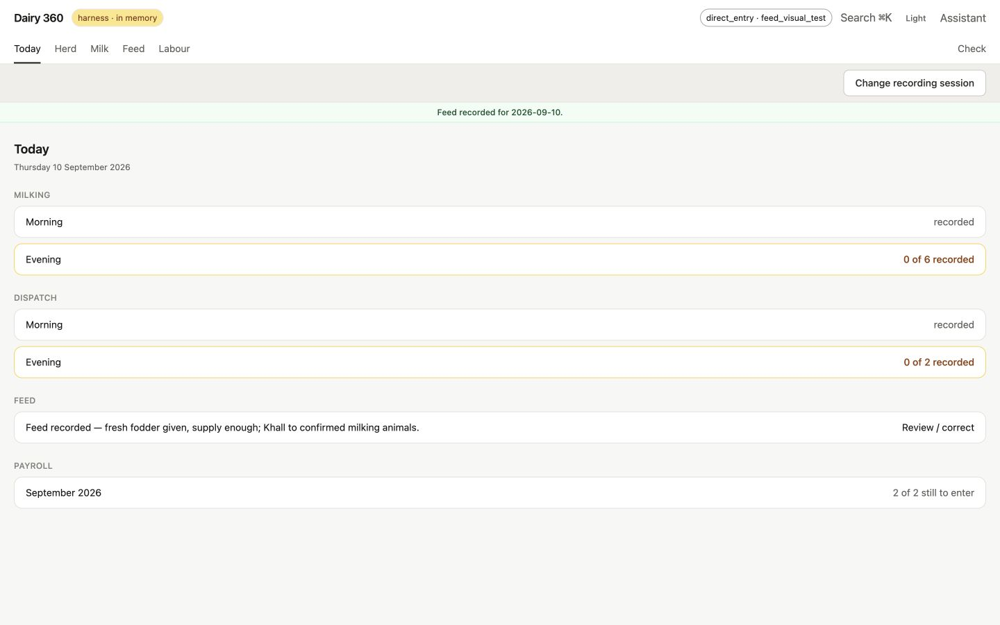
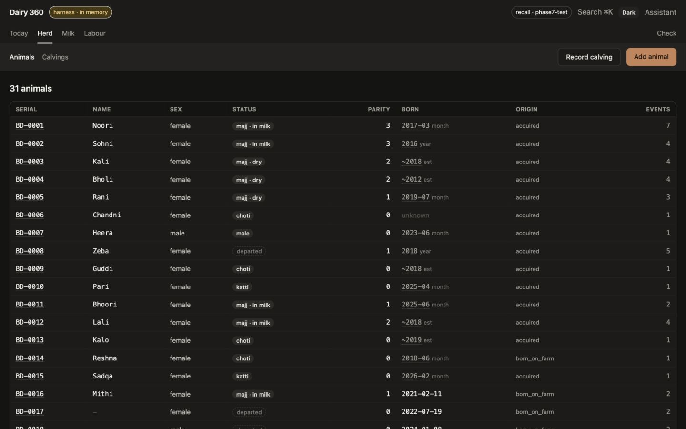
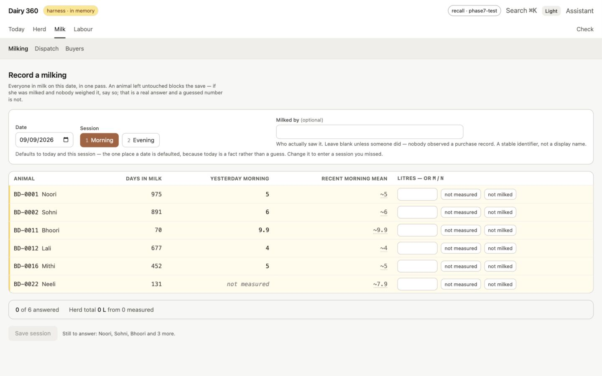

# Dairy Farm Management Agent

[](./LICENSE)
[](https://github.com/i-adnanali/dairy-360/actions/workflows/ci.yml)

A working AI **multi-agent system** for managing a dairy farm. Two agents share
one process: a **dairy agent** (animals, milk yields, feed, health events) and a
**vendor/sales agent** (vendors, deliveries, balances), with one deliberate point
of contact — reconciling milk *produced* against milk *delivered*. A thin
per-turn dispatcher routes each message to the right agent (or both). The agents
answer questions about the farm **and take real actions** — but every
agent-requested state change is gated behind an explicit human confirmation.

The multi-agent design (and what was deliberately *not* built — no second
service/A2A, no orchestrator LLM, no auth) is documented in
[docs/MULTI_AGENT.md](docs/MULTI_AGENT.md).

The registry brings the day's outstanding work, animal histories, milk, feed and labour
recording into one workspace. These screenshots use the in-memory demo harness.

**Today — see what still needs recording.**



**Herd — browse status and dates without hiding uncertainty.**



**Milking — record each animal's answer explicitly.**



[Phase 7 screen gallery](docs/images/phase7/README.md) ·
[Feed routes and updated Today gallery](docs/images/feed/README.md).
The galleries identify their build dates, themes and viewport coverage.

**Just want to see it run?** `npm run harness:app` — [one command, no key, no
database](#just-looking-one-command-no-key-no-database).

It is built as an npm-workspaces monorepo with an **Angular frontend** backed by
one Express server:

```
dairy-360/
  shared/       # TypeScript types shared by server + web (single source of truth)
  server/       # Express + Anthropic SDK orchestrator, SQLite, tools, dispatcher, two agents
  web-angular/  # Angular 22 (standalone, zoneless) + Tailwind + ng2-charts frontend
```

> **Archived:** an earlier React frontend and its blocking `POST /api/chat`
> route (plus `server/src/agent/loop.ts`) were removed once Angular became the
> sole actively developed target. They remain permanently checkable via git
> history at the `archive/react-frontend-final` and `v0.2.0` tags; the reasoning
> is in [docs/AGUI_MIGRATION.md](docs/AGUI_MIGRATION.md).

### The agent protocol

The Angular frontend talks to the agent over a single streaming endpoint:

| Frontend       | Endpoint             | Transport                                   |
| -------------- | -------------------- | ------------------------------------------- |
| `web-angular/` | `POST /api/agent/run`| [AG-UI](https://docs.ag-ui.com) streaming events over SSE. |

`/api/agent/run` streams the turn as AG-UI events (`RUN_STARTED`,
`TEXT_MESSAGE_*`, `TOOL_CALL_*`, `RUN_FINISHED`, plus app-specific `CUSTOM`
events — `agent.dataset`, `agent.messages`, `agent.pending`, and `agent.selection`
for which agent handled the turn), so the Angular UI shows text token-by-token,
tool-call chips, and a per-turn agent tag as they happen. Tracing lives one layer
below the transport, in the shared agent logic (tools, read/write split, digest
shaper, confirmation gating). The multi-agent design is in
[docs/MULTI_AGENT.md](docs/MULTI_AGENT.md); the Angular port in
[docs/ANGULAR_PORT.md](docs/ANGULAR_PORT.md); the AG-UI migration and its design
decisions in [docs/AGUI_MIGRATION.md](docs/AGUI_MIGRATION.md).

Alongside the chat transport there are two webhook endpoints,
`POST /api/webhooks/frigate` and `POST /api/webhooks/double-take`, which ingest
camera events into a `farm_events` table. They accept the real Frigate and
Double Take wire formats and are exercised by a synthetic scenario generator —
no camera hardware involved. See [docs/FARM_EVENTS.md](docs/FARM_EVENTS.md).

A third surface, `/api/registry`, is the **animal registry** (Cycle 8): an
append-only event log over the real herd with rebuildable projections, served to
an operations UI that is the app's root. Its schema, entry rules, date-precision
conventions and known gaps are in [docs/REGISTRY.md](docs/REGISTRY.md); the
entry surface is [docs/REGISTRY_ENTRY_UX.md](docs/REGISTRY_ENTRY_UX.md),
per-animal milk yield is
[docs/REGISTRY_MILKING.md](docs/REGISTRY_MILKING.md), the commercial half — who
buys the milk, at what rate, and what they owe — is
[docs/REGISTRY_SALES.md](docs/REGISTRY_SALES.md), and the people who work the
herd are [docs/REGISTRY_PAYROLL.md](docs/REGISTRY_PAYROLL.md). Those guides own the domain behavior; [UI_SYSTEM.md](docs/UI_SYSTEM.md)
owns the current presentation and shell.

The registry covers the animal record, milk sales, labour and feed. Only the
animal record uses the original step numbering. Feed adds crop cycles and expenses,
original-unit purchases and one daily feeding account with corrections and history;
[REGISTRY_FEED.md](docs/REGISTRY_FEED.md) records its implementation and limits.

Milk sales follow the farm’s actual collection arrangements. Milk leaves the bulk twice a day to a dodhi, to neighbouring households,
and to the farm's own kitchen — so a **destination** covers all three, home use
is recorded rather than lost in a gap, prices are **effective-dated and quoted in
40-litre lots** the way the farm agrees them, and what is owed is a **ledger**
rather than a paid/unpaid flag, because a part payment against three weeks of
collections belongs to no single delivery.

Labour gets the same sentence, because it is the other half a dairy runs on.
People are separate from **engagements** — one row per stint, so somebody who
leaves and comes back does not silently inherit their old salary — a package is
an **effective-dated agreement** of cash plus in-kind lines (milk, flour,
quarters) rather than a single number, dihari cover is the same table as a
salaried month because both are a dated range, and what is owed is the **same
ledger as the buyers' with the sign the other way up**. An advance needs no
flag: the balance simply goes negative and the next period walks it back.

The agent has read-only tools over the herd and milk sales; it has no payroll
or registry-feed tools. There are three tools over the herd
(`list_registry_animals`, `get_registry_animal`, `get_calving_intervals`) and
four over the sales side (`list_buyers`, `get_buyer_balance`, `get_dispatches`,
`get_milk_reconciliation`). **Reads only** — real records are still entered
through the registry UI, deliberately. The point is not chat-over-a-database:
every digest carries how well the record knows what it reports, so calving
intervals stay split into `measured` and `approximate` and are never pooled, a
month-precision date is never narrated as an exact day, and the produced-versus-
sold gap comes back with **no percentage at all** when production is a lower
bound. A live eval asserts the assistant's *prose* on the first of those. See
[docs/REGISTRY_TOOLS.md](docs/REGISTRY_TOOLS.md) and
[docs/REGISTRY_SALES.md](docs/REGISTRY_SALES.md).

Those rows are then **read for meaning**: a deterministic classifier scores each
event `routine` / `notable` / `urgent` from zone, time of day, face confidence,
and how often an unrecognized face has recurred, and a reconciliation pass
reports attendance gaps and camera-silence gaps across a day. The agent gets
three tools over that layer (`get_farm_events`, `summarize_daily_activity`,
`flag_anomaly`) and does the narrating; no model call happens inside the
classifier. See [docs/FARM_MONITOR.md](docs/FARM_MONITOR.md).

## How this demonstrates assistant → agent

This demo is built to make four principles **observably true** in the running
app. Here is exactly where each one lives in the code. The same four are covered
at more depth in [docs/PROJECT_OVERVIEW.md](docs/PROJECT_OVERVIEW.md) §§4–7, and
at source-line depth in [docs/TECHNICAL.md](docs/TECHNICAL.md) §§1–3.

### 1. The agent loop (interpret → execute → digest)

The model's native tool-calling drives everything — there is no hand-written
intent parsing. The loop in
[`server/src/agent/stream.ts`](server/src/agent/stream.ts) sends the conversation
and tool schemas to the model, runs whatever tools it calls, feeds results back,
and repeats until the model stops calling tools and writes the final answer. Tool
schemas live in [`server/src/tools/index.ts`](server/src/tools/index.ts) and the
system prompt (with a live farm catalog injected) in
[`server/src/agent/systemPrompt.ts`](server/src/agent/systemPrompt.ts).

The one deliberate, narrow exception to "no hand-written intent parsing" is the
**dispatcher** ([`server/src/agent/dispatch.ts`](server/src/agent/dispatch.ts)):
per turn it selects which agent — `dairy`, `vendor`, or `both` (the safe
default) — sees the turn, and the loop offers only that agent's tools + system
prompt. It only *routes*; each agent still reasons over its own tools exactly as
above. Reconciliation (`get_yield_vs_deliveries`) is offered only to `both`,
since it's the one tool that spans both domains.

### 2. Read/write split (writes are human-gated)

Read tools (dairy: [`server/src/tools/reads.ts`](server/src/tools/reads.ts);
vendor: [`server/src/tools/vendorReads.ts`](server/src/tools/vendorReads.ts))
execute automatically inside the loop. Write tools (dairy:
[`server/src/tools/writes.ts`](server/src/tools/writes.ts); vendor:
[`server/src/tools/vendorWrites.ts`](server/src/tools/vendorWrites.ts)) never run
on their own: when the model calls one, `runAgentStream` **pauses** and emits a
`PendingWrite` confirmation card (via the `agent.pending` CUSTOM event). Nothing is written until the
user approves; the resume path executes only the approved writes and records a
"declined" tool result for the rest. Re-sending the same pre-write history and approval in a new request can repeat
the write: approval consumption is local to one run, with no cross-request replay
store. Registry HTTP idempotency does not protect agent executors. Both agents share this exact pause/resume
mechanism.

### 3. Display data is not reasoning data

`get_milk_yield` runs through the digest shaper in
[`server/src/tools/shaper.ts`](server/src/tools/shaper.ts). The **full time
series** (every bucket) is shipped to the client as a `Dataset` and rendered as
a chart — it **never enters the model's context**. The model receives only a
small **digest** (totals, mean, min/max, first/last, period-over-period %). You
can watch this in Langfuse: each read tool call is traced as its own observation,
with the model digest (not the raw rows) recorded as its output.

### 4. Wrong cheaply, never expensively

- **Bad args → structured errors the model can retry.** Read tools return
  `{ error: ... }` digests (e.g. `missing_scope`, `unknown_group`) instead of
  throwing.
- **Hallucinated IDs are blocked for free.** The ID-integrity guard
  (`guardIds` in [`server/src/tools/index.ts`](server/src/tools/index.ts)) checks
  every `animal_id`/`group`/`vendor_id`/`delivery_id` against the DB *before* any
  tool runs.
- **Oversized requests are capped deterministically.** The shaper coarsens
  `day → week` past 90 days and `→ month` past a year before doing any work, so a
  huge range can't blow up the dataset or the digest.
- **The loop is bounded.** `max_tokens` per call and a max-iteration cap (with a
  graceful "narrow it down" message) live in `stream.ts`.

## Scale design

The herd is ~14 animals, so the full catalog fits cheaply in the system prompt.
But `search_animals` is already implemented with a top-K bound (8) and a
`tooMany` flag, and `buildSystemPrompt` will omit the inline animal list and
steer the model to `search_animals` once the herd exceeds a threshold (300).
The seam is wired even though the demo never crosses it.

## Documentation

**[docs/README.md](docs/README.md) is the index.** It separates *reference* (what
is true now — keep it current) from *record* (what was decided then, one per
cycle, tied to a git tag), and routes by intent.

The three you are most likely to want:

- **[docs/PROJECT_OVERVIEW.md](docs/PROJECT_OVERVIEW.md)** — how the system fits
  together: the agentic workflow end to end, the data model, the wire contract.
  This README summarises it above; that document is the full version.
- **[docs/TECHNICAL.md](docs/TECHNICAL.md)** — the loop internals, the eight
  guardrails, and the tool contracts, at source-line depth.
- **[docs/DEVELOPMENT.md](docs/DEVELOPMENT.md)** — setup, test, run and backups,
  with every command verified against a real run.

**[docs/OPEN.md](docs/OPEN.md)** is the single list of everything unfinished —
blocking items, known-safe defects, deferred capability, and undecided questions.

## Tech stack

- **Server:** Node, TypeScript, Express, official Anthropic SDK
  (`@anthropic-ai/sdk`). AG-UI SSE streaming (`@ag-ui/encoder` + `@ag-ui/core`)
  via `anthropic.messages.stream()` for `/api/agent/run`.
- **Observability:** self-hosted [Langfuse](https://langfuse.com) via its
  OTel-based JS SDK (`@langfuse/tracing`, `@langfuse/otel`,
  `@opentelemetry/sdk-node`); see [Observability](#observability-langfuse).
- **Database:** SQLite via `better-sqlite3` (synchronous, zero-config).
- **Frontend (Angular):** Angular 22 standalone + zoneless, signals, Tailwind CSS,
  `ng2-charts` (Chart.js), `marked` + `DOMPurify` for markdown.
- **Model:** default `claude-sonnet-4-6` (override with `ANTHROPIC_MODEL`); falls
  back once to `claude-sonnet-4-5` on a 400/404 before any output is emitted.

> **Node version:** the **Angular 22** frontend requires Node
> `^22.22.3 || ^24.15.0 || >=26`. Use a satisfying version (e.g. via `nvm`).

## Setup & run

### Just looking? One command, no key, no database

```bash
nvm use && npm install     # first time only
npm run harness:app
```

Open <http://localhost:4200>. You land on the **day board** — the evening
milking and dispatch outstanding, this month's payroll still to enter — over an
in-memory herd of 31 animals with every life stage, calvings entered out of
order, a paired date correction, an overridden check and dates at all four
precisions. Behind it: a dodhi, two households and the farm's own kitchen with
five sessions of milk sold and kept, and three staff — two salaried, one dihari
— with last month paid, one balance open, one settled and one in advance.
Feed fixtures add active/finished crops, expenses, measured and unweighed purchases,
a mixed-source feeding day and a partial account; extend the range to see a missing day.

Everything is seeded **over HTTP through the same routes the forms use**, so no
row exists that the production write path would refuse. `server/dairy.db` is
never opened by any process this starts. No `ANTHROPIC_API_KEY`, no
`npm run seed`, nothing to clean up afterwards.

Two things that path does **not** give you, so you are not left hunting. The
**agent chat at `/chat` will not answer**: the harness mounts only
`/api/registry` and `/api/harness`, so `/api/health` and `/api/agent/run` are
absent entirely (404, not the friendly `unseeded` message) — the chat needs the
full setup below. And nothing is persisted, so a restart is a fresh herd.

`npm run harness:app` and `npm run seed` are two separate dummy-data systems for
two separate surfaces; the difference is tabulated in
[docs/DEVELOPMENT.md § 6](docs/DEVELOPMENT.md).

### The full setup

```bash
# 1. install (compiles the better-sqlite3 native binding)
npm install

# 2. configure your key -- TWO destinations, see the header of .env.example
cp .env.example server/.env   # the SERVER reads this one (dotenv is cwd-relative)
cp .env.example .env          # docker compose reads this one (camera stack)
# then edit BOTH and add ANTHROPIC_API_KEY to server/.env

# 3. create + seed the SQLite database (idempotent: drop + recreate)
npm run seed -w server      # creates server/dairy.db

# 4. run server (:4000) + Angular web (:4200); ng proxies /api -> :4000
npm run dev:angular
```

Then open <http://localhost:4200> (Angular). The app opens on a **day board**
at `/` — what still needs recording today, and nothing else — with the registry
under `/animals`, milk under `/milk`, labour under `/labour`, feed under `/feed`, and the agent chat
page at `/chat`. The registry is a separate surface over real herd records and
is documented in [docs/REGISTRY.md](docs/REGISTRY.md) — including how to run it
against fixture data instead of the real database.

**Reads need no session.** Browsing the herd, a statement or `/check` asks for
nothing; declaring who is recording and from what source is required only where
something is about to be written, and the write control says so where it stands.

**[docs/DEVELOPMENT.md](docs/DEVELOPMENT.md) is the verified long form of setup**
— the Node floor and what ignores it, why `.env` is copied twice, the two run
loops and how to tell which one you are in, the registry CLI, the fresh-clone
path, and what a skipped test suite does and does not prove. Its verification
dates distinguish measured results from current instructions and unverified steps.

The two files own different halves and neither contains the other: the **registry
CLI** (`registry:add`, `registry:calve`, `registry:event`,
`registry:correct-calving`) and the **four regression suites** are documented only
there; the **camera, ingestion and Langfuse** commands only here. The
[Command reference](#command-reference) below is the operational cheat sheet.

`GET /api/health` returns `{ status: "ok", seeded: true, anthropicKey: <bool> }`
once the DB is seeded. If you start the server before seeding, the health check
and agent endpoint return a friendly "run `npm run seed` first" message instead
of failing obscurely.

## Command reference

Every command worth running, grouped by task: the app, build and test, dummy
data, the registry, farm-event ingestion and classification, and the self-hosted
Langfuse stack. Each appears once. See [Setup & run](#setup--run) for the
first-time flow, [Observability](#observability-langfuse) for what the Langfuse
stack is, and [docs/DEVELOPMENT.md](docs/DEVELOPMENT.md) for the registry CLI and
the regression suites, which are documented only there.

> **Node version first.** The Angular frontend needs Node
> `^22.22.3 || ^24.15.0 || >=26`. If you use `nvm`, the repo pins a version in
> [`.nvmrc`](.nvmrc) — run `nvm use` (or `nvm install`) in the repo root before
> the app commands below, or `ng serve` fails with a Node-version error.

### Frontend + backend (app)

```bash
# start server (:4000) + Angular (:4200) together; ng proxies /api -> :4000
npm run dev:angular
# open the app
open http://localhost:4200

# backend only (no Angular)
npm run dev -w server

# stop: press Ctrl-C in the terminal running it.
# stop a stray/backgrounded instance (frees ports 4000 + 4200):
lsof -tiTCP:4000 -sTCP:LISTEN | xargs -r kill
lsof -tiTCP:4200 -sTCP:LISTEN | xargs -r kill
```

### Build, typecheck, test

```bash
npm run typecheck            # shared + server
npm run build:angular        # shared + the Angular frontend

npm test -w server           # digest shaper, farm normalizers, classifier, registry
npm test -w web-angular      # Vitest unit tests for the frontend
```

> `npm test -w server` needs no DB file and no API key — the registry suites run
> against `:memory:`; backup tests also create and clean up temporary files.
> They do not use the live database. The **live-model regression
> suites** (`test:regression`, and the `:core` / `:cap` / `:fallback` / `:registry` splits) do
> need a key and are documented in [docs/DEVELOPMENT.md § 5](docs/DEVELOPMENT.md);
> a skipped run is not a pass.

### Dummy data — the app with a herd in it, and no real database

```bash
# harness (:4000, in-memory) + a 31-animal seeded herd + Angular (:4200)
npm run harness:app
open http://localhost:4200

# re-seed a harness that is already up (replays; does not duplicate)
npm run harness:seed

# confirm which database is behind /api -- `memory` is the discriminator
curl http://localhost:4000/api/registry/storage
# harness -> {"storage":":memory:","memory":true}
# real    -> {"storage":"/.../server/dairy.db","memory":false}

# confirm the real file was never touched. THIS is the durable check: it opens
# no database, so it has no failure mode and stays true after real entry starts.
stat -f '%Sm  %z bytes' server/dairy.db && shasum -a 256 server/dairy.db

# row counts, if you want them. NOTE: `immutable=1`, not `-readonly`.
# dairy.db is in WAL mode, and a read-only connection cannot create the -shm
# file WAL needs -- so `sqlite3 -readonly` fails with "unable to open database
# file (14)" whenever the sidecars are absent, which is their normal state once
# the last connection closes. `immutable=1` skips WAL entirely and creates
# nothing; it assumes no writer is active, which is what you are asserting.
sqlite3 'file:server/dairy.db?immutable=1' 'select count(*) from registry_animals'

# the PRODUCTION bundle instead of ng serve, on :4300
npm run build:angular && npm run harness:serve -- --port=4300
```

`harness:app` and `npm run seed` fill **different tables for different
screens** — registry vs the six demo tables, entry UI vs the agent chat. Under
`harness:app` the chat at `/chat` will report unseeded, which is correct. The
comparison is in [docs/DEVELOPMENT.md § 6](docs/DEVELOPMENT.md).

### Registry — the real records

```bash
# serve the registry API over an in-memory fixture herd; the explicit port matters
npm run registry:harness -w server -- --port=4000

# invariants, precision histogram, calving intervals, milk-record completeness
npm run verify:registry -w server
# ...against a backup instead, read-only
npm run verify:registry -w server -- --db=backups/<file>.db

# recompute the projection tables from the event log
npm run registry:rebuild -w server

# snapshot the four irreplaceable tables (VACUUM INTO + a diffable .sql dump)
npm run registry:backup -w server
```

> `registry:backup` also runs automatically before any migration; see
> [docs/DEVELOPMENT.md § 8](docs/DEVELOPMENT.md). `harness:app` wraps
> `registry:harness`. Entering and correcting records from the CLI —
> `registry:add`, `registry:calve`, `registry:event`, `registry:correct-calving`
> — is in [docs/DEVELOPMENT.md § 7](docs/DEVELOPMENT.md) and
> [docs/REGISTRY.md](docs/REGISTRY.md).

### Status / health checks

```bash
curl http://localhost:4000/api/health            # -> {"status":"ok","seeded":true,"anthropicKey":true}
docker compose -f docker-compose.langfuse.yml ps  # Langfuse container health
open http://localhost:3000                         # Langfuse UI
```

### Farm event ingestion (synthetic)

Synthetic camera-event plumbing — these commands need no hardware or agent reasoning. Needs the server
running; see [docs/FARM_EVENTS.md](docs/FARM_EVENTS.md).

```bash
# replay one scenario, backdated 3 days
npm run simulate:farm -w server -- --scenario=night-visitor-unknown --days-ago=3

# replay every scenario
npm run simulate:farm -w server -- --all --days-ago=14

# list the scenario names and flags
npm run simulate:farm -w server -- --help

# prove every scenario lands correctly in farm_events (exits non-zero on a diff)
npm run verify:farm -w server
```

> `verify:farm` clears `farm_events` before each scenario and again when it
> finishes, so it leaves the table empty. It does not touch the dairy tables,
> and `npm run seed -w server` does not touch `farm_events`.

### Live camera validation (Cycle 7)

Captures **real** Frigate and Double Take events off MQTT and diffs their shape
against the payload documented in [docs/FARM_EVENTS.md](docs/FARM_EVENTS.md).
Hardware-gated, run once per window, and destructive to set up — so the full
procedure lives with the record of the run rather than here:

- Frigate — [docs/cycle-7-live-camera-validation.md § To run the capture](docs/cycle-7-live-camera-validation.md)
  (`capture:frigate`, `verify:payload`)
- Double Take — [docs/Cycle7-fu3-double-take-validation.md § To run the capture](docs/Cycle7-fu3-double-take-validation.md)
  (`enroll:synthetic`, `capture:doubletake`, `verify:payload:dt`)

Both carry caveats this section used to omit — the DeepStack restart without
which every face resolves as unknown and the window is wasted, and
`--topic='frigate/#'` for topic discovery when nothing arrives. Neither stack
may outlive its capture window; both teardowns take `-v`.

### Farm event classification

Reads those rows for meaning: routine / notable / urgent per event, plus
attendance and camera-silence reconciliation across a day. Needs the server
running; see [docs/FARM_MONITOR.md](docs/FARM_MONITOR.md).

```bash
# classify + reconcile every scenario and assert the verdicts
npm run verify:classify -w server

# one scenario only
npm run verify:classify -w server -- --scenario=recurring-unknown-visitor
```

> Both farm scripts pin `TZ=Asia/Karachi`: the generator composes scenario start
> times in the *host's* zone, so an unpinned run on a UTC machine would stamp
> `night-visitor-unknown` at 02:14 UTC — 07:14 farm-local, inside working hours,
> silently failing the off-hours flag the scenario exists to produce.
>
> `verify:classify` resets `farm_events` before each scenario, and that is
> required rather than tidy: the `unknown_a1` cluster id appears in two
> scenarios, so a shared table would give it four sightings in one lookback
> window and corrupt every recurrence count. `simulate:farm --all` accumulates
> all six scenarios into one table and is for ingestion checks only — never use
> it as the basis for a recurrence assertion.

### Langfuse Docker stack

```bash
# start (Postgres, ClickHouse, Redis, MinIO, langfuse-web, langfuse-worker)
docker compose -f docker-compose.langfuse.yml up -d

# first run pulls ~6 images (a few GB); watch until all are healthy:
docker compose -f docker-compose.langfuse.yml ps

# stop + remove containers, KEEP trace data (volumes persist)
docker compose -f docker-compose.langfuse.yml down

# stop + remove containers AND drop all trace data (deletes volumes)
docker compose -f docker-compose.langfuse.yml down -v
```

> After creating a project in the Langfuse UI, copy its public + secret keys into
> `.env` (`LANGFUSE_PUBLIC_KEY` / `LANGFUSE_SECRET_KEY`; `LANGFUSE_BASE_URL`
> defaults to `http://localhost:3000`) and restart the server. On startup it
> prints `[tracing] Langfuse enabled -> http://localhost:3000`. With the keys
> unset, tracing is silently disabled and the agent runs normally.

### Teardown / reset

```bash
docker compose -f docker-compose.langfuse.yml down -v   # tear down Langfuse + trace data
npm run seed -w server                                   # reset server/dairy.db to seeded state
```

> Re-seed if you approved any write actions during a session — approved writes
> mutate `server/dairy.db`, and seeding restores the reproducible baseline.

## Observability (Langfuse)

Every agent turn is traced with a **self-hosted [Langfuse](https://langfuse.com)**
instance, instrumented via its OTel-based JS SDK (`@langfuse/tracing`,
`@langfuse/otel`, `@opentelemetry/sdk-node`). Tracing sits one layer below the
AG-UI transport, in the shared tool-call/model-call logic, so it is decoupled
from the wire protocol.

```bash
# 1. start the Langfuse stack (Postgres, ClickHouse, Redis, MinIO, web + worker)
docker compose -f docker-compose.langfuse.yml up -d

# 2. open the UI, create a project, copy its keys into .env
open http://localhost:3000        # LANGFUSE_PUBLIC_KEY / LANGFUSE_SECRET_KEY

# 3. run the app as usual; traces stream to Langfuse
npm run dev:angular
```

What gets traced, per turn:

- **One trace per run**, grouped into a **session keyed by `threadId`** — so an
  approval **pause and its resume are two traces under one session**, not two
  disconnected traces.
- **A generation observation per model call**, with token counts pulled from the
  Anthropic response `usage` so Langfuse infers cost with no hand-rolled pricing
  table.
- **A tool observation per read/write tool call**, recording the model digest
  (never the raw dataset rows) as output.
- **Custom trace attributes:** `digest_size` and `dataset_rows` (to correlate
  response shape with latency/cost), `finish_reason`
  (`completed` / `iteration_cap` / `awaiting_approval`), and `agent`
  (`dairy` / `vendor` / `both` — which agent the dispatcher routed the turn to).

If the `LANGFUSE_*` keys are unset, tracing is silently disabled and the agent
runs normally.

## Out of scope

Authentication, multi-user tenancy, billing, inventory forecasting, nutrition
recommendations and cloud deployment are outside the current local application.
Domain-specific corrections/removals and camera ingestion are implemented.
Animal events remain append-only; other domains have their own removal policies.

See [REGISTRY_FEED.md](docs/REGISTRY_FEED.md) for feed verification, defaults and
the documented CLI test-isolation incident; [OPEN.md](docs/OPEN.md) tracks remaining work.
