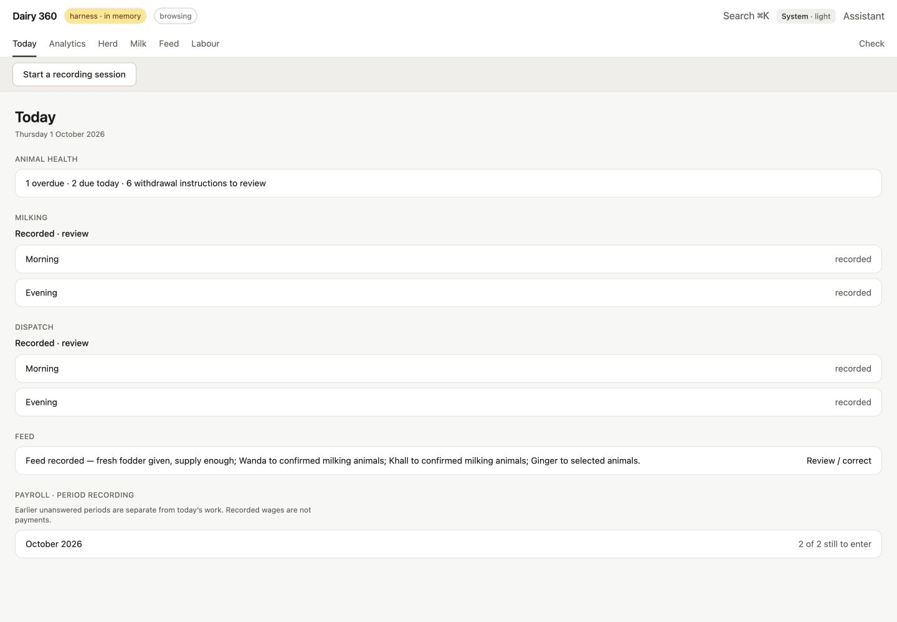
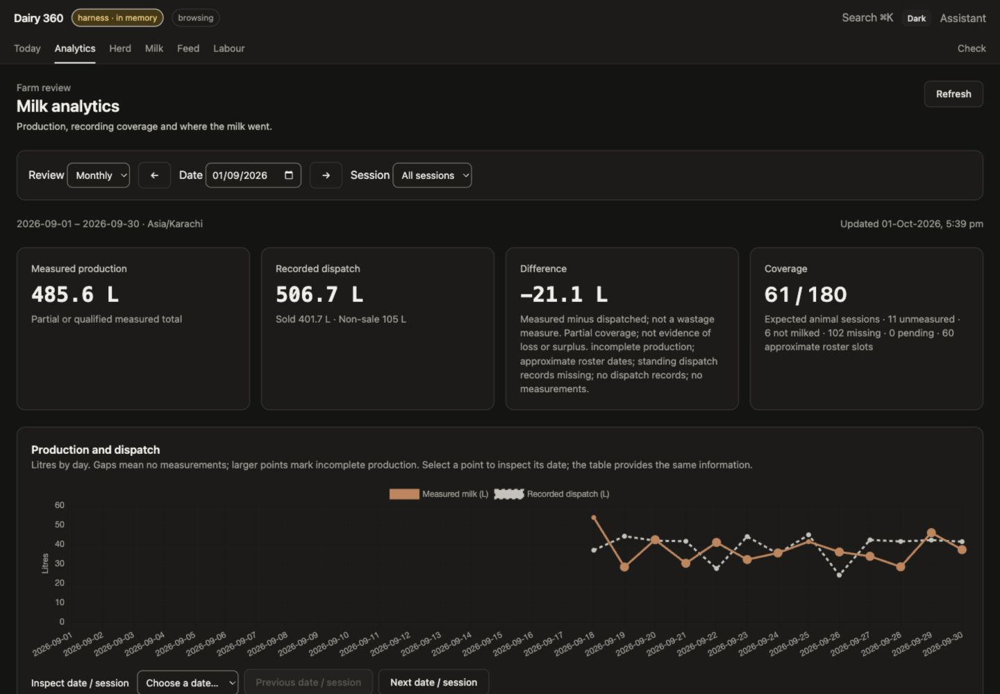
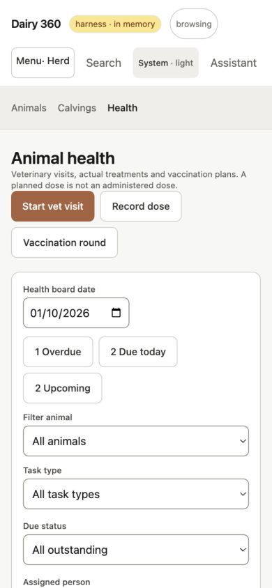

# Dairy 360

[](https://github.com/i-adnanali/dairy-360/actions/workflows/ci.yml)
[](LICENSE)

A local dairy-farm workspace for animal records, veterinary care, milk production and sales, feed, people and payroll—with an optional AI assistant for questions and proposed actions.

Dairy 360 keeps uncertainty visible: approximate dates stay approximate, missing records stay distinct from zero, wages earned stay distinct from payments, and approval stays distinct from successful execution.



*Current production UI at `a56400a`, captured 1 October 2026 using synthetic, memory-only records. [Screenshot provenance and gallery](docs/images/current/README.md).*

[Quick start](#quick-start) · [Features](#features) · [Screenshots](#screenshots) · [Development](#development) · [Documentation](#documentation) · [Status and limitations](#status-and-limitations)

## Quick start

Requires Git, npm and **Node 22.22.3**, pinned in [`.nvmrc`](.nvmrc). Install once at the repository root.

```bash
git clone https://github.com/i-adnanali/dairy-360.git
cd dairy-360
nvm install
nvm use
npm ci
npm run harness:app
```

Open **http://localhost:6420**. This starts Angular and a synthetic registry backend on port 6400. No API key or farm database is needed; fixture writes disappear when the harness stops. Press Ctrl+C to stop.

The harness supports registry workflows, but does **not** serve assistant responses. For a larger analytics scenario, stop it and run `npm run harness:analytics`, then open `/analytics`. Both commands share ports with the persistent app.

### Persistent app and AI assistant

```bash
npm run build:shared
cp .env.example server/.env
# Edit server/.env: set ANTHROPIC_API_KEY for the assistant.
# Leave LANGFUSE_PUBLIC_KEY and LANGFUSE_SECRET_KEY empty unless configured.
npm run seed -w server
npm run dev:angular
```

The persistent server uses `server/dairy.db`; the registry and the assistant's demo tables are separate. `seed` resets the demo tables used by chat, preserves registry records, and is **not** a registry fixture loader. Registry agent tools are read-only; proposed agent writes target the demo domains, not registry records.

Read [setup and data boundaries](docs/DEVELOPMENT.md) before using persistent data. Browsing requires no recording session; registry writes require an explicit recorder and source. A root `.env` is needed only for optional camera Compose configuration. Langfuse is optional.

## Features

| Area | Capabilities |
|---|---|
| Today | Task entry points, outstanding versus recorded sessions, health due work and payroll recording status |
| Animals | Herd search, calvings, event history, precision-aware corrections and provenance |
| Health | Visits, examinations, cases, plans, actual administrations, vaccination rounds, withdrawal instructions and life reports |
| Milk | Per-animal session recording, sale and non-sale dispatch, effective-dated rates, buyer balances and payments |
| Feed | Crop lifecycles and expenses, purchases in original units, daily feeding and saved recipient snapshots |
| People & payroll | Separate employment stints, package history, salaried/daily wages, payments and signed adjustments |
| Analytics | Daily/weekly/monthly production and dispatch, qualified coverage, date inspection, data tables and source drilldowns |
| Assistant | Streaming answers, contextual prompts, charts, expandable details and explicit approval/result receipts |
| Data checks | Separate invariant violations, advisory work and coverage gaps |

### Recent improvements

The screen-specific audit implementation landed in [`a56400a`](https://github.com/i-adnanali/dairy-360/commit/a56400a):

- Clearer People actions and payment-before-history layout; focused Feed forms, crop filters and compact overview disclosures.
- Combined animal identity, precision-aware history/correction summaries, clearer Today work groups and a Milking → Dispatch continuation after success.
- Grouped Health entry with retained exception explanations, synchronized analytics date inspection and shared chart/data presentation.
- Outcome-specific assistant receipts, complete mobile navigation, unknown-route recovery, and a concise UI reference/state specimen.

Native semantics, APIs, calculations, historical rates, snapshots, provenance, draft guards, revision handling and exact-request retries were preserved. See the [implementation ledger](docs/implementation/GEIST-IMPLEMENTATION.md).

## Screenshots

These are fresh captures of the current application, not design mockups. Desktop: 1440×1000; mobile: 390×844. All records are synthetic. Long pages continue below the viewport.

<details>
<summary>Monthly analytics — dark theme</summary>



</details>

<details>
<summary>Animal health — mobile light theme</summary>



</details>

[Current gallery and capture details](docs/images/current/README.md) · [Current UI reference](docs/UI-CURRENT.md)

## Architecture

```text
dairy-360/
├── web-angular/  Angular 22, standalone components, signals, Tailwind, Chart.js
├── server/       Express, TypeScript, SQLite, agent loop and registry APIs
├── shared/       Shared domain and transport types
├── scripts/      Local harness, verification and capture utilities
└── docs/         Reference guides, implementation evidence and dated records
```

The Angular app uses `/api/registry` for operational records and `/api/agent/run` for AG-UI streaming over SSE. The optional assistant routes each turn to dairy, vendor/sales, or both agents in one server process. Read tools run automatically; proposed writes pause for approval. Model-facing digests remain separate from chart datasets.

Camera-event ingestion/classification and self-hosted Langfuse tracing are optional integrations. See [architecture](docs/PROJECT_OVERVIEW.md), [agent internals](docs/TECHNICAL.md) and [integration operations](docs/OPERATIONS.md).

## Development

Run from the repository root after `nvm use` and `npm ci`:

```bash
npm run build:shared
npm run typecheck
npm test -w server
npm test -w web-angular -- --watch=false
npm run check:templates
npm run check:contrast
npm run build:angular
```

The frontend build is written to `web-angular/dist/web-angular/browser`. To serve it against an already running memory harness on 6400, run `npm run harness:serve` and open http://localhost:6430.

**Latest recorded validation (1 October 2026):** 458 frontend tests across 44 files, 779 server tests, production build and typecheck passed. The contrast gate passed 122 graded checks with no held or unexpected failures. Existing bundle-size and shared CommonJS warnings remain. [Logs and browser evidence](docs/implementation/geist-screen-evidence/ACCEPTANCE.md).

Unit suites need no API key or farm database. Live-model regression tests are separate, require credentials, and can spend API tokens; a skipped live run is not a pass. See [testing](docs/DEVELOPMENT.md#5-test).

## Documentation

| Need | Guide |
|---|---|
| Documentation map | [Docs index](docs/README.md) |
| Setup, troubleshooting, CLI and backups | [Development](docs/DEVELOPMENT.md) |
| Current UI contracts | [UI reference](docs/UI-CURRENT.md), [detailed system/history](docs/UI_SYSTEM.md) |
| Animals and corrections | [Registry](docs/REGISTRY.md) |
| Milk recording and sales | [Milking](docs/REGISTRY_MILKING.md), [sales](docs/REGISTRY_SALES.md) |
| Feed, health and labour | [Feed](docs/REGISTRY_FEED.md), [health](docs/REGISTRY_HEALTH.md), [payroll](docs/REGISTRY_PAYROLL.md) |
| Metrics and uncertainty | [Analytics specification](docs/ANALYTICS_SPEC.md) |
| Optional camera/tracing integrations | [Operations](docs/OPERATIONS.md) |
| Remaining work | [Open items](docs/OPEN.md), [acceptance limits](docs/implementation/geist-screen-evidence/ACCEPTANCE.md#remaining-acceptance--explicitly-open) |

## Status and limitations

This is a local application without authentication or multi-user tenancy. It is not documented as production-hardened. Registry HTTP retry protections do not provide cross-request replay protection for assistant demo writes.

Screen-specific implementation is complete; comprehensive acceptance remains open. Native-device/screen-reader/zoom, print/export artifact verification, live assistant execution, exhaustive browser fault injection and operator walkthroughs have not all been completed. Existing evidence states exactly what was performed. Those acceptance tasks remain deferred.

## Contributing

Open an issue with a reproducible problem or proposed scope, then submit a focused pull request. Use synthetic data, retain domain uncertainty and write protections, run the relevant checks above, and update the owning reference guide. Never commit database files, uploads, credentials or real farm records. See [development conventions](docs/DEVELOPMENT.md) and [UI contracts](docs/UI-CURRENT.md).

## License

[MIT](LICENSE) © 2026 Adnan Ali.
