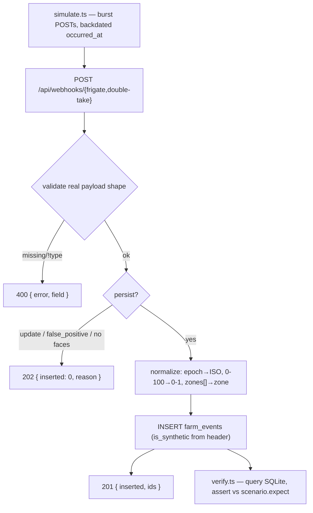

# Farm Events & Ingestion — Decision Doc (Cycle 4)

*Status: complete — Phases 00–05, tagged `v0.7.0`. All six scenarios plus 13
payload-rejection cases verify green against the live ingestion endpoints.
Prerequisite: `docs/REGRESSION.md` (Cycle 3) complete and tagged `v0.6.0`.*

> **Extended by Cycle 5** ([FARM_MONITOR.md](FARM_MONITOR.md), tagged
> `v0.8.0`). This document remains the record of the ingestion layer and is
> still accurate about it, but three things here have since changed:
>
> - **`farm_events` gained four classification columns** (`classified_at`,
>   `flagged`, `flag_severity`, `flag_reason`). The DDL and the `FarmEvent`
>   interface reproduced in Decision 3 are the Cycle 4 shape, not the current
>   one. Ingestion itself is untouched — it now builds an `IngestedFarmEvent`
>   (everything except those four), which the DB defaults fill in.
> - **The farm timezone open item is resolved.** `FARM_TZ = 'Asia/Karachi'`,
>   and both farm scripts now pin `TZ=Asia/Karachi`. See Decision 4 there.
> - **`simulate:farm --all` is no longer safe for every purpose.** It is still
>   correct for the ingestion checks described here, but anything
>   classification-aware must reset `farm_events` before each scenario, because
>   `unknown_a1` appears in two scenarios and a shared table corrupts every
>   recurrence count.

## Context

Cycles 1–3 built out the dairy/vendor agent: observability
([OBSERVABILITY.md](OBSERVABILITY.md)), a second agent plus a dispatcher and
reconciliation ([MULTI_AGENT.md](MULTI_AGENT.md)), and a live-model regression
suite ([REGRESSION.md](REGRESSION.md)). All three operate on data a human
typed in.

Cycle 4 is the first step of a different extension: a Farm Monitor Agent that
eventually classifies camera events and summarizes farm activity. That agent
needs an event stream to reason over, and there is currently nothing in the
schema that can hold one.

This cycle deliberately builds **only the plumbing** — schema, ingestion
endpoints, a synthetic scenario library, a generator, and a verification
script. No agent logic. The goal is that swapping the generator for real
Frigate/Double Take webhooks in a later cycle is a configuration change, not a
rewrite; everything below that carries a cost is justified by that one claim.

## What we're NOT doing

- **No Farm Monitor Agent.** No dispatcher classification, no reconciliation
  summaries, no new tool set, no `systemPrompt.ts`/`catalog.ts` changes.
  `farm_events` rows are written and read back by SQL only.
- **No vision captioning.** No Claude vision calls on snapshots.
- **No AG-UI/SSE streaming to the Angular frontend.** No new CUSTOM events,
  no frontend files touched. A "watch it happen" replay is a Cycle 5 frontend
  concern; the generator here runs in burst mode.
- **No Telegram notifications.**
- **No real Frigate/Double Take integration or camera hardware.** Cycle 7.
- **No face-embedding computation or face clustering.** Identities and cluster
  ids are asserted as ground truth in synthetic payloads, never derived from a
  model. See *Known fidelity gaps* — this is the one place the
  config-change-not-a-rewrite claim does not hold, and it is deliberate.
- **No camera health monitoring.** See Decision 1.
- **No formal regression suite.** The verification script here checks pipeline
  integrity only — there is no agent behavior to assert against yet. (Cycle 5
  did reuse these fixtures, adding `verify:classify` alongside `verify:farm` to
  assert the verdicts drawn from these rows.)
- **No migration framework.** This repo has never had one and this cycle does
  not introduce one. See Decision 3.
- **No Vitest on the server.** [REGRESSION.md](REGRESSION.md) § *What we're NOT
  doing* rejected this by name: Vitest is a `web-angular`-only dependency, and
  `node:test` via `tsx --test` is already the server's runner. Verification is
  a plain script; the one unit test added is `node:test`.

## Decision 1 — `camera_offline` is dropped from this cycle

The original draft of this spec had a `camera_offline` event type and a
`camera-dropout` scenario that produced one. Neither Frigate nor Double Take
emits anything of the kind: a dead camera is detected by polling Frigate's
`/api/stats`, or by noticing the absence of events. So shipping
`camera_offline` now would mean inventing a webhook endpoint with no real
producer behind it — building ahead of the evidence, the same failure mode
caught in *Known fidelity gaps* below.

Therefore:

- `camera_offline` is **not** in the `event_type` CHECK.
- There is **no** `watchdog` source and no camera-status endpoint.
- `camera-dropout` becomes an **absence-based** scenario: it asserts that no
  rows landed for a given camera/zone after a cutoff offset, while a control
  camera keeps producing rows. This is a real, checkable assertion and it is
  the honest shape of the signal — dropout genuinely *is* silence.

**Documented limitation:** until camera health monitoring exists, a dropout is
indistinguishable from a genuinely quiet camera. Resolving that needs a
watchdog with a real polling loop, deferred to Cycle 7 when real hardware
gives evidence for what the mechanism should be.

## Decision 2 — Real payload shapes, not flattened mocks

The endpoints accept the **actual** wire format of each system, verified
against upstream docs. The earlier flattened mock payloads
(`{camera, label, zone, score, timestamp, id}`) were convenient but would have
forced an adapter rewrite in Cycle 7, which is exactly the promise this cycle
exists to keep.

### Frigate — `frigate/events` envelope

Real shape (fields elided; see
[Frigate MQTT docs](https://docs.frigate.video/integrations/mqtt/)):

```json
{
  "type": "new",
  "before": { "...": "previous state" },
  "after": {
    "id": "1607123955.475377-mxklsc",
    "camera": "gate_cam",
    "label": "person",
    "sub_label": null,
    "score": 0.7890625,
    "top_score": 0.958984375,
    "false_positive": false,
    "start_time": 1607123955.475377,
    "end_time": null,
    "current_zones": ["driveway"],
    "entered_zones": ["yard", "driveway"],
    "has_snapshot": true,
    "has_clip": false,
    "stationary": false
  }
}
```

Differences from the flat mock that actually matter:

| Flat mock | Reality |
| --- | --- |
| top-level fields | nested under `before`/`after`; `after` is current state |
| — | `type` is `new` \| `update` \| `end` — up to 3 POSTs per event, same `id` |
| `zone` (string) | `current_zones` / `entered_zones` are **arrays**, often `[]` |
| `timestamp` (ISO) | `start_time` / `end_time` / `frame_time` are **epoch float seconds** |
| `score` | both `score` (current frame) and `top_score` (best over event lifetime) |
| — | `false_positive` boolean |
| — | `has_snapshot` boolean; no snapshot path in the payload |
| `id` | same, format `{epoch}.{micros}-{suffix}` |

### Double Take — camera event payload

Real shape (see
[Double Take README](https://github.com/jakowenko/double-take)):

```json
{
  "id": "1607123955.475377-mxklsc",
  "duration": 4.25,
  "timestamp": "2021-06-17T03:19:55.695Z",
  "attempts": 5,
  "camera": "gate_cam",
  "zones": [],
  "matches": [
    {
      "name": "employee_2",
      "confidence": 91.4,
      "match": true,
      "box": { "top": 286, "left": 744, "width": 319, "height": 397 },
      "type": "latest",
      "duration": 0.8,
      "detector": "compreface",
      "filename": "dcb772de-d8e8-4074-9bce-15dbba5955c5.jpg",
      "base64": null
    }
  ],
  "misses": [],
  "unknowns": [],
  "counts": { "person": 1, "match": 1, "miss": 0, "unknown": 0 }
}
```

Double Take turned out to have a **worse** fidelity gap than Frigate:

| Flat mock | Reality |
| --- | --- |
| `event_id` | the field is `id`, and it carries the **Frigate** event id |
| `match` (single object) | `matches` is an **array** — several faces per frame. (The `double-take/matches/<name>` topic does use a singular `match`; both shapes are accepted.) |
| `confidence: 0.91` | **confidence is on a 0–100 scale** — a real payload would say `91.4`. The mock was wrong by 100×. |
| — | `misses` — a *named* identity that fell below Double Take's threshold |
| — | `unknowns` — a face detected with no name at all |
| — (zone absent) | `zones` **is** present (array, frequently empty) |
| `timestamp` | same, ISO 8601 — the one field the mock got right |
| — | `counts` summary, `filename` per face, `box`, `detector`, `attempts` |

Two consequences worth calling out, because they change the data model's
meaning:

1. **Confidence is normalized to 0–1 on ingestion** (`confidence / 100`), so
   the `confidence` column means one thing regardless of source and is
   directly comparable to Frigate's `top_score`. Storing Double Take's native
   0–100 alongside Frigate's 0–1 would make every downstream threshold a
   source-dependent trap.
2. **`misses` is what `low-confidence-match` actually is.** A Double Take
   "miss" is a recognized name below the confidence threshold — precisely the
   "tests hedging, not certainty" case the scenario wants. So `misses` entries
   are persisted as `face_match` rows with a low confidence, and
   **`event_type = 'face_match'` does not mean "confident match"**. The
   `confidence` value is the only discriminator; threshold policy belongs to
   the Cycle 5 agent, not to the schema.

### Known fidelity gaps

Recorded rather than papered over, since Decision 2 is the whole reason this
cycle costs what it costs:

- **`unknown_cluster` has no real producer for cross-event linking.** The
  event type itself is grounded — Double Take genuinely emits `unknowns[]`,
  and persisting one row per entry costs nothing extra. What's synthetic is
  `recurring-unknown-visitor`'s premise: a stable cluster id held constant
  across days. This is the same "ground truth asserted, not derived"
  exception already granted to `identity` on `face_match` rows, but it is
  not equivalent in weight: `identity` will come from a Double Take
  capability that already works once real cameras and enrolled photos
  exist in Cycle 7; cross-day cluster linking will not — it requires new,
  undesigned clustering or re-identification work, and real systems in
  that space commonly produce false merges and splits rather than a clean,
  stable id. The scenario's unchanging id is a simplification for early
  agent-design purposes, not a fidelity claim, and Cycle 5 should not
  build reconciliation logic that assumes real recurring ids will be this
  stable — cluster continuity itself is something Cycle 5 should
  eventually reason about probabilistically, not trust as ground truth.
  **Cycle 5 honoured this:** recurrence is a weighted signal that can only
  raise severity within its own rule, and it is outranked by the
  restricted-zone/off-hours check, so no verdict ever rests on cluster
  identity being real (see [FARM_MONITOR.md](FARM_MONITOR.md) Decision 8).
- **Only `type: "new"` is persisted.** `update` and `end` are accepted and
  ignored. Ingesting `end` would give dwell time, which nothing in Cycle 4
  consumes; deferred rather than built speculatively.
- **`zone` is denormalized to a single value.** A multi-zone event keeps its
  full arrays in `raw_payload` but the indexed `zone` column holds only the
  first. See Decision 3.

## Decision 3 — Data model

Additive to the schema in [server/src/db.ts](../server/src/db.ts), same
`TEXT PRIMARY KEY` / prefixed-id convention as `animals`, `milkings`,
`vendors`, `deliveries`.

```sql
CREATE TABLE IF NOT EXISTS farm_events (
  id              TEXT PRIMARY KEY,          -- farm_event_<8 hex>, generated
  source          TEXT NOT NULL CHECK (source IN ('frigate','double_take')),
  source_event_id TEXT,                      -- Frigate event id; NOT unique
  is_synthetic    INTEGER NOT NULL DEFAULT 0,
  camera_id       TEXT NOT NULL,
  zone            TEXT,                      -- nullable: both sources emit [] often
  event_type      TEXT NOT NULL CHECK (
                    event_type IN ('detection','face_match','unknown_cluster')
                  ),
  identity        TEXT,
  confidence      REAL,                      -- always 0..1, normalized on ingest
  occurred_at     TEXT NOT NULL,             -- ISO-8601 UTC (…Z)
  ingested_at     TEXT NOT NULL,             -- ISO-8601 UTC (…Z), set in TS
  snapshot_ref    TEXT,
  raw_payload     TEXT NOT NULL              -- the request body, verbatim
);
CREATE INDEX IF NOT EXISTS idx_farm_events_occurred_at ON farm_events(occurred_at);
CREATE INDEX IF NOT EXISTS idx_farm_events_zone        ON farm_events(zone);
CREATE INDEX IF NOT EXISTS idx_farm_events_identity    ON farm_events(identity);
CREATE INDEX IF NOT EXISTS idx_farm_events_source_ref  ON farm_events(source_event_id);
```

### Design notes

- **`id` is generated, never the source event id.** Frigate sends
  `new`/`update`/`end` for the same `id`, and one Double Take POST can carry
  several faces, so the source id is not unique per row. Format follows the
  house pattern in [server/src/tools/writes.ts](../server/src/tools/writes.ts):
  `farm_event_${randomUUID().slice(0, 8)}`.
- **`source_event_id` is the Frigate↔Double Take join key.** Both systems carry
  it, and it is the only thing tying a `face_match` to the `detection` it
  enriches. Without a column it would survive only inside `raw_payload` JSON,
  under two different key names — leaving the Cycle 5 agent to `json_extract`
  across both. Indexed; deliberately **not** unique.
- **`zone` is nullable.** Both sources legitimately emit an empty zone list: a
  person detected on a camera but inside no defined zone has no zone. A
  `NOT NULL` column would have been unsatisfiable for every Double Take row
  and for a large share of real Frigate ones.
- **`confidence` is always 0..1**, whatever the source sent. See Decision 2.
- **`identity` and `confidence` nullability:** a `detection` has no `identity`
  but *does* carry a `confidence` (the object-detection score — real signal,
  and what `low-confidence-match` hinges on). `face_match` and
  `unknown_cluster` populate both.
- **`is_synthetic` exists from day one** so real and generated data can coexist
  and be filtered apart once Cycle 7 adds hardware, avoiding a later schema
  change. It is set from a **request header**, not a payload field — see
  Decision 4.
- **Timestamps are ISO-8601 UTC strings in both columns**, generated in
  TypeScript. Note there is deliberately **no**
  `DEFAULT (datetime('now'))`: SQLite's `datetime('now')` yields
  `2026-08-24 05:42:11` (space-separated, no zone) while `occurred_at` yields
  `2026-08-24T05:42:11Z` — two formats in one table, not lexicographically
  comparable. This is also the repo's first datetime column of any kind; every
  existing date column is `YYYY-MM-DD`.
- **`CHECK` constraints are a deliberate deviation.** No other table in
  [db.ts](../server/src/db.ts) uses one — enums live in SQL comments and are
  enforced by TypeScript types plus tool `input_schema` enums. The threat model
  differs: webhook bodies arrive from outside the process, where tool args
  arrive from a model already constrained by a schema. Implementation note: a
  CHECK violation *throws* inside better-sqlite3, so it must be caught and
  mapped to a 400, never surfaced as a 500.
- **`raw_payload` retains the original body verbatim** for traceability when
  debugging a mismatch between what was sent and what the agent later reasoned
  about — including the fields the normalizer drops (zone arrays, boxes,
  detector names).
- **`snapshot_ref` is derived, not sent.** Frigate's payload has only
  `has_snapshot: bool`, so the ref is built as
  `/api/events/{id}/snapshot.jpg`; Double Take supplies a per-face `filename`,
  built as `/api/storage/matches/{filename}`. Neither is fetched in Cycle 4 —
  they are recorded strings, resolved against real hosts in Cycle 7.

### Schema lifecycle — no migrations, and no seed coupling

This repo has no migration system: the entire schema is one `SCHEMA` template
literal in [db.ts](../server/src/db.ts), applied by `resetSchema()`, which
drops every table and recreates it. So "schema + migration" reduces to adding
SQL to `db.ts`.

But `farm_events` must **not** join that reset cycle. `npm run seed -w server`
would wipe every farm event, and worse, the Cycle 3 regression suite calls
`seed()` in `beforeEach` — so running the regression suite would truncate farm
data mid-run. Harmless today, a landmine later.

Therefore `farm_events` lives in a **separate `FARM_SCHEMA` const** using
`CREATE TABLE IF NOT EXISTS`, applied at db-module load and absent from
`resetSchema()`'s DROP list, plus an explicit `resetFarmEvents()` for the
verification script. Still raw SQL in `db.ts`, still no framework — minimal
drift. A useful side effect: ingestion works against an unseeded database,
which matters because `GET /api/health` 503s when unseeded but webhooks have
no reason to care about dairy seed data.

### Shared types

Matching domain types in [shared/src/types.ts](../shared/src/types.ts), per the
"DB row types mirror the SQLite schema" rule at the head of that file:

```ts
export type FarmEventSource = 'frigate' | 'double_take';
export type FarmEventType = 'detection' | 'face_match' | 'unknown_cluster';

export interface FarmEvent {
  id: string;
  source: FarmEventSource;
  source_event_id: string | null;
  is_synthetic: boolean;      // 0/1 in SQLite, normalized like Delivery.paid
  camera_id: string;
  zone: string | null;
  event_type: FarmEventType;
  identity: string | null;
  confidence: number | null;  // 0..1
  occurred_at: string;
  ingested_at: string;
  snapshot_ref: string | null;
  raw_payload: string;
}
```

`is_synthetic` follows the `deliveries.paid` precedent: stored `0`/`1`, with a
`toFarmEvent()` row mapper normalizing it to a boolean, exactly as
`toDelivery()` does today.

The ERD in [PROJECT_OVERVIEW.md](PROJECT_OVERVIEW.md) § 8 is extended with
`farm_events`, shown unlinked — it has no foreign key to any dairy table, the
same deliberate separation `deliveries`/`milkings` already document.

## Decision 4 — Ingestion contract

Two endpoints, mounted under `/api` like every other route in this app
(both existing routes are `/api/*`, and
[web-angular/proxy.conf.json](../web-angular/proxy.conf.json) proxies only
`/api`):

- `POST /api/webhooks/frigate`
- `POST /api/webhooks/double-take`

They live in an `express.Router()` in `server/src/farm/routes.ts`, mounted with
one line in [server/src/index.ts](../server/src/index.ts). Routes are inline in
`index.ts` today, but there are only two of them; a new domain adding several
more follows Cycle 2's actual precedent — new sibling files rather than
bloating an existing one.

The generator targets these endpoints over HTTP rather than writing to SQLite
directly, so the normalizer gets real coverage now.

### `is_synthetic` — a header, not a payload field

Nothing in either real payload can mark a request as synthetic, and adding a
field would diverge the synthetic shape from the real one, breaking the exact
promise Decision 2 exists to keep. So the generator sends:

```
X-Synthetic-Source: simulator
```

Present and non-empty → `is_synthetic = 1`. Real webhooks omit it → `0`.

### Normalization — Frigate

| Step | Rule |
| --- | --- |
| Validate | `type` ∈ `{new, update, end}`; `after` is an object; `after.id`, `after.camera`, `after.label`, `after.start_time` all present → else `400` |
| Skip | `type !== 'new'` → `202`, no row (see *Known fidelity gaps*) |
| Skip | `after.false_positive === true` → `202`, no row |
| `source` | `'frigate'` |
| `source_event_id` | `after.id` |
| `event_type` | `'detection'` |
| `camera_id` | `after.camera` |
| `zone` | `after.entered_zones?.[0] ?? after.current_zones?.[0] ?? null` |
| `identity` | `null` |
| `confidence` | `after.top_score ?? after.score ?? null` (already 0..1) |
| `occurred_at` | `after.start_time` epoch-float-seconds → ISO-8601 UTC |
| `snapshot_ref` | `after.has_snapshot ? \`/api/events/${after.id}/snapshot.jpg\` : null` |
| `raw_payload` | the full request body |

`zone` prefers `entered_zones[0]` over `current_zones[0]`: the zone that
triggered the event is more meaningful than wherever the object drifted to.

### Normalization — Double Take

One POST can produce **several rows** — one per face.

| Step | Rule |
| --- | --- |
| Validate | `id`, `camera`, `timestamp` present → else `400` |
| Validate | at least one of `matches` / `match` / `misses` / `unknowns` present → else `400` |
| Normalize | a singular `match` object is treated as a one-element `matches` array (the `double-take/matches/<name>` topic shape) |
| Rows | one per entry in `matches` ∪ `misses` → `event_type = 'face_match'` |
| Rows | one per entry in `unknowns` → `event_type = 'unknown_cluster'` |
| Skip | all four arrays empty → `202`, no rows |
| `source` | `'double_take'` |
| `source_event_id` | body `id` (the Frigate event id) |
| `camera_id` | body `camera` |
| `zone` | `body.zones?.[0] ?? null` |
| `identity` | entry `name`, verbatim |
| `confidence` | entry `confidence` **÷ 100** |
| `occurred_at` | body `timestamp`, normalized to ISO-8601 UTC |
| `snapshot_ref` | `entry.filename ? \`/api/storage/matches/${entry.filename}\` : null` |
| `raw_payload` | the full request body |

`event_type` is decided by **which array an entry came from**, never by
inspecting the name. The earlier draft proposed "`unknown_cluster` when
`match.name` looks like a generated cluster id" — array membership is
structural and honest, and it removes the need for the normalizer to know
which identities are enrolled. (The fixtures still need that roster, to build
realistic payloads and to express `absent-employee`; the normalizer does not.)

### Responses

| Code | Meaning | Body |
| --- | --- | --- |
| `201` | rows created | `{ inserted: n, ids: [...] }` |
| `202` | valid but intentionally not persisted | `{ inserted: 0, reason: 'update' \| 'false_positive' \| 'no_faces' }` |
| `400` | validation failure | `{ error: '<code>', ...detail }` |

Error bodies reuse the repo's existing structured-error convention from
`guardIds()` in [server/src/tools/index.ts](../server/src/tools/index.ts),
which returns `{ error: 'unknown_animal', animal_id }`. Codes:
`missing_field` (+ `field`), `invalid_type` (+ `type`),
`invalid_timestamp` (+ `value`), `invalid_payload`, `invalid_enum` (+ `column`,
from a caught CHECK violation).

Nothing is ever silently dropped or silently accepted: every request returns a
code that says which of the three happened, and `202` names its reason.



## Decision 5 — Repository layout

The draft suggested `fixtures/farm-scenarios/<name>.ts` and
`scripts/simulate-farm-events.ts`. Neither directory exists, and three pieces
of evidence point elsewhere:

- **No root `scripts/`.** Every runnable lives at `server/src/*.ts` behind
  `npm run <x> -w server` → `tsx src/<x>.ts`.
  [server/src/seed.ts](../server/src/seed.ts) is the exact precedent for a
  data-generating script, including its `if (require.main === module)` guard.
- **No `fixtures/`.** Test data is one module of exported consts:
  [server/src/agent/\_\_tests\_\_/scenarios.ts](../server/src/agent/__tests__/scenarios.ts)
  holds all twelve Cycle 3 scenarios in a single file.
- **Decisively:** [server/tsconfig.json](../server/tsconfig.json) sets
  `rootDir: "src"` / `include: ["src"]`. Anything at a root `scripts/` or
  `fixtures/` would silently escape `npm run typecheck` — a CI gate.

So everything lands in a new `server/src/farm/` sibling to `agent/` and
`tools/`:

| File | Role |
| --- | --- |
| `server/src/farm/ingest.ts` | Validation + normalization, pure functions over a request body. No Express, no DB. |
| `server/src/farm/ingest.test.ts` | `node:test` unit tests for the above: rejection codes, epoch→ISO, 0–100→0–1, `zones[]`→`zone`, multi-face fan-out. |
| `server/src/farm/routes.ts` | `express.Router()` — the two endpoints, header handling, insert, status codes. |
| `server/src/farm/scenarios.ts` | The scenario library: one const per scenario plus a registry map. |
| `server/src/farm/simulate.ts` | The generator. |
| `server/src/farm/verify.ts` | The verification script. |

`ingest.ts` being pure — parsing and validation separated from Express and
SQLite — is what lets `ingest.test.ts` run inside plain `npm test -w server`
with no DB and no key, matching that CI step's existing "pure shaper tests"
constraint. It also means `npm test -w server` picks it up automatically: the
`src/**/*.test.ts` glob matches one directory deep, which `src/farm/` is.

New scripts in [server/package.json](../server/package.json):

```jsonc
"simulate:farm": "tsx src/farm/simulate.ts",
"verify:farm":   "tsx src/farm/verify.ts"
```

> Both gained a `TZ=Asia/Karachi` prefix in Cycle 5, and a third script
> (`verify:classify`) joined them. See [FARM_MONITOR.md](FARM_MONITOR.md)
> Decision 4 for why the generator's host-local timestamps make that pin
> necessary.

`verify.ts` must **not** be named `*.test.ts`, or CI would run it without a
server listening.

## Decision 6 — Local dev target: the shared dev database

`DB_PATH` is a module-level const with `new Database(DB_PATH)` executed at
import time in [db.ts](../server/src/db.ts) — there is no existing seam for a
second file, and adding one is scope this cycle does not need. The closest
precedent, the Cycle 3 regression suite, runs against `server/dairy.db` and
scopes itself by resetting its own data. And `*.db` is gitignored, so a
separate file would not be committed either way.

So Cycle 4 uses **`server/dairy.db`**, and the verification script scopes
itself the same way Cycle 3 does: `resetFarmEvents()` before each scenario,
verify that scenario, move on. That also satisfies "clears or scopes to a test
run" without adding a column. (If `--all` ever needs verifying in a single
pass, a nullable `scenario TEXT` populated only for synthetic rows is the cheap
upgrade — deliberately not built now.)

## Scenario library

### Format

The draft's `{offsetMs, source, payload}` tuple cannot express the scenarios:
`night-visitor-unknown` ("off-hours"), `normal-weekday` ("arriving on
schedule") and `low-confidence-match` all depend on time of day, and
`--days-ago=<n>` plus an offset from an unspecified start gives no way to pin
02:14 against 05:40. Note also that `daysAgo()` in
[seed.ts](../server/src/seed.ts) returns a date-only `YYYY-MM-DD`, so it cannot
be reused for this directly.

Each scenario therefore declares its own start time, and offsets run from
there:

```typescript
export interface ScenarioEvent {
  offsetMs: number;
  source: FarmEventSource;
  /** Real Frigate / Double Take shaped. Timestamp fields are stamped by the
   * generator, in each source's native format. */
  payload: Record<string, unknown>;
}

export interface ScenarioExpectation {
  rowCount: number;
  rows?: Partial<Pick<FarmEvent,
    'camera_id' | 'zone' | 'event_type' | 'identity' | 'confidence'>>[];
  /** camera-dropout: assert nothing landed for this camera after the cutoff. */
  absences?: { camera_id: string; zone?: string; afterOffsetMs: number }[];
}

export interface Scenario {
  name: string;
  description: string;
  startTime: string;   // 'HH:MM:SS', farm-local — see Timekeeping
  events: ScenarioEvent[];
  expect: ScenarioExpectation;
}
```

Scenarios are values in a `SCENARIOS` registry map keyed by name, mirroring
`WRITE_EXECUTORS` and the Cycle 3 `scenarios.ts`.

### Timekeeping

The generator composes an absolute instant per event —
`daysAgo(n)` date + scenario `startTime` + `offsetMs` — then writes it into
each payload in that source's **native** format: epoch float seconds for
Frigate `start_time`, ISO-8601 for Double Take `timestamp`. Speaking both
formats is the generator's main job.

`startTime` is interpreted in the **host's local timezone**, matching the
local-noon anchoring `daysAgo()` already uses. Generator and verifier share
that interpretation, so verification is self-consistent on any machine. The
honest caveat: on a UTC CI runner, "off-hours" is off-hours in UTC, not on the
farm. A fixed farm timezone becomes necessary the moment the Cycle 5 agent
reasons about "night" — recorded as an open item, not resolved now.

The generator rejects any computed `occurred_at` in the future. This matters
for `recurring-unknown-visitor`, whose own offsets span several days forward
from the anchor: `--days-ago` sets the *earliest* day, and the scenario extends
forward from it.

### Identity roster

`absent-employee` needs to know who was *expected*, and the fixtures need to
know which names are enrolled to build realistic payloads. Following the
repo's preference for explicit registries (`WRITE_EXECUTORS`, the `ANIMALS`
const) over magic-string parsing, `scenarios.ts` exports an
`ENROLLED_IDENTITIES` set. In Cycle 7 this becomes the Double Take enrollment
list.

Unknown-cluster ids are **fixed constants, never generated per run.** The
evidence is unambiguous: `seed()` re-seeds its `mulberry32` RNG on every call
specifically so data is byte-identical, and Cycle 3 derives its windows from
the same `daysAgo()` the seed uses so they line up exactly. Determinism is the
house rule. Fixed ids also make `recurring-unknown-visitor` work by
construction and let verification exact-match rather than pattern-match.

### Scenarios

| Name | What it exercises |
| --- | --- |
| `normal-weekday` | Baseline — enrolled employees arriving on schedule, routine zone activity, nothing anomalous |
| `absent-employee` | An enrolled identity from `ENROLLED_IDENTITIES` never appears — sets up Cycle 5 reconciliation |
| `night-visitor-unknown` | `unknowns[]` face, restricted zone, off-hours start time |
| `recurring-unknown-visitor` | The *same* fixed cluster id across several backdated days |
| `camera-dropout` | One camera stops producing events mid-scenario while a control camera continues — asserted via `absences` (Decision 1) |
| `low-confidence-match` | A Double Take `misses[]` entry — a named identity below threshold, landing as `face_match` with low `confidence` |

Six is enough for this cycle. `multiple-simultaneous-zones` and
`family-member-routine` are reasonable additions if the above feel thin once
built, but are not required for definition of done.

## Generator

`server/src/farm/simulate.ts`, run via `npm run simulate:farm -w server`.

- Loads one named scenario or `--all`
- Computes an absolute backdated start from `--days-ago=<n>`
- **Burst mode** — POSTs immediately with correct backdated timestamps, no
  artificial delay. A slowed-down "watch it happen" replay is a Cycle 5
  frontend concern.
- Stamps each payload's timestamp fields in the source's native format
- Sends `X-Synthetic-Source: simulator`
- Logs per-event status; exits non-zero if any POST fails or returns an
  unexpected status

```bash
npm run simulate:farm -w server -- --scenario=night-visitor-unknown --days-ago=3
npm run simulate:farm -w server -- --all --days-ago=14
```

## Verification

`server/src/farm/verify.ts`, run via `npm run verify:farm -w server`, with the
dev server already listening. Per scenario: `resetFarmEvents()` → replay that
scenario → query `farm_events` directly → assert `expect`.

It first checks that `:4000` answers at all, and treats the unseeded-`503` from
`GET /api/health` as reachable-and-fine — ingestion does not depend on dairy
seed data. Absent a server, it fails with a message saying to start one, the
same degrade-gracefully convention as `/api/health` itself.

### Definition of done

For every scenario in the library:

1. Replaying it produces the expected number of rows in `farm_events` —
   accounting for Double Take's multi-face fan-out and Frigate's
   `update`/`end` no-ops.
2. Each row's `camera_id`, `zone`, `identity`, `confidence` (0..1) and
   `event_type` match what the scenario declares.
3. `occurred_at` falls inside the scenario's backdated window and is never in
   the future; `ingested_at` reflects real replay time. Both are ISO-8601 UTC.
4. `is_synthetic = 1` on every generated row.
5. `camera-dropout`'s `absences` hold: no rows for the dropped camera after the
   cutoff, and the control camera still produced rows.
6. Malformed and incomplete payloads are rejected with a `4xx` naming the
   failure, and intentional no-ops return `202` with a reason — neither
   silently dropped nor silently accepted.
7. `verify.ts` exits `0` for the full set, non-zero with a clear diff on any
   failed assertion.

No agent, dispatcher, or UI work is required to call Cycle 4 complete.

## Implementation plan

Phased and tagged the same way as `multi-agent/*` and `regression/*`:

| Phase | Scope | State |
| --- | --- | --- |
| `farm-events/00-decisions` | This doc; `farm_events` added to the ERD in PROJECT_OVERVIEW.md § 8. | ✅ |
| `farm-events/01-schema` | `FARM_SCHEMA` + `resetFarmEvents()` + `toFarmEvent()` and read helpers in `db.ts`; `FarmEvent`/`FarmEventType`/`FarmEventSource` in `shared/src/types.ts`. | ✅ |
| `farm-events/02-ingest` | `farm/ingest.ts` normalizers against the real payload shapes, `farm/ingest.test.ts` (28 cases), `farm/routes.ts`, one mount line in `index.ts`. | ✅ |
| `farm-events/03-scenarios` | `farm/scenarios.ts` — six scenarios, `ENROLLED_IDENTITIES`, fixed cluster ids, per-scenario `expect`. | ✅ |
| `farm-events/04-generator` | `farm/simulate.ts`, `simulate:farm` script, native timestamp stamping, future-date guard. | ✅ |
| `farm-events/05-verification` | `farm/verify.ts`, `verify:farm` script, full-set pass (6/6 scenarios + 13 rejection cases); README "Useful scripts" + "Command reference" updated. Tag `v0.7.0`. | ✅ |

No CI change: `ingest.test.ts` is picked up by the existing
`npm test -w server` step, and `verify:farm` needs a running server so it stays
a local command — the same reason the Cycle 3 live suite is gated rather than
unconditional.

## Open items

- ~~**Farm timezone.**~~ **Resolved in Cycle 5:** `FARM_TZ = 'Asia/Karachi'`,
  confirmed rather than inferred. `classify.ts` converts `occurred_at` into that
  zone explicitly and never trusts host-local time; `TZ=Asia/Karachi` is pinned
  on the farm scripts to cover the generator, which still composes `startTime`
  host-locally. Making the *generator* zone-aware remains open — see
  [FARM_MONITOR.md](FARM_MONITOR.md) § Open items.
- **`unknown_cluster` has no real producer** (see *Known fidelity gaps*). The
  Cycle 7 shape — embeddings plus clustering over Double Take's `unknowns[]`,
  or enrolling unknowns on the fly — is genuinely undecided, and it is the one
  place the config-change claim does not hold.
- **Camera health monitoring** deferred to Cycle 7 per Decision 1. Until then
  a dropout and a quiet camera are indistinguishable.
- **Frigate `end` events are dropped**, so dwell time is unavailable. Cheap to
  add when something consumes it.
- **Multi-zone events lose fidelity in the indexed `zone` column.** Cycle 5
  turned out not to need multi-zone reasoning — its restricted-zone rule matches
  the single indexed `zone` against a set — so this stayed deferred. The options
  remain a `farm_event_zones` join table or a JSON column, still waiting for a
  query that wants it.
- **No retention policy.** Real cameras produce orders of magnitude more rows
  than a dairy herd does; `farm_events` will need pruning or rollup long before
  `milkings` does. Out of scope here, but it is the first table in this schema
  that will ever need it.
- **`raw_payload` size.** Real Frigate payloads carry `before` *and* `after`
  with boxes and attributes — roughly 2 KB per row against a `2mb`
  `express.json()` limit that was set for chat turns. Fine at Cycle 4 volumes,
  worth re-checking against real event rates in Cycle 7.
