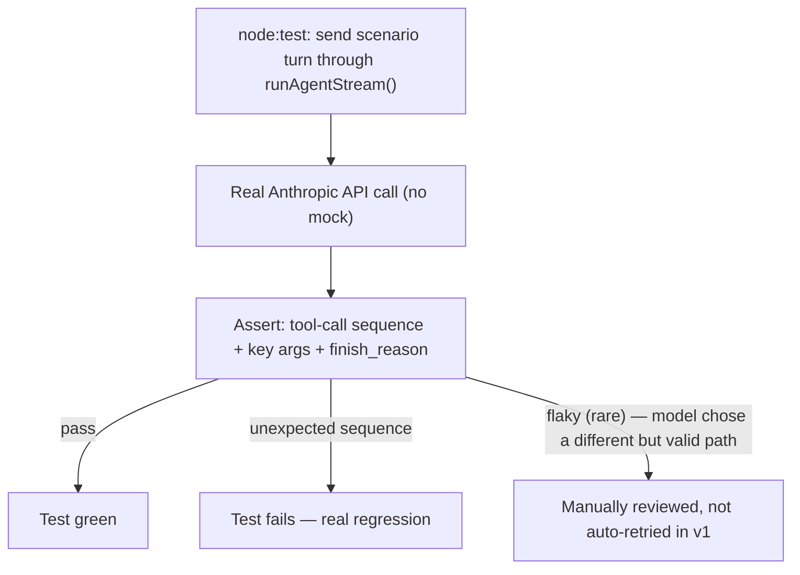
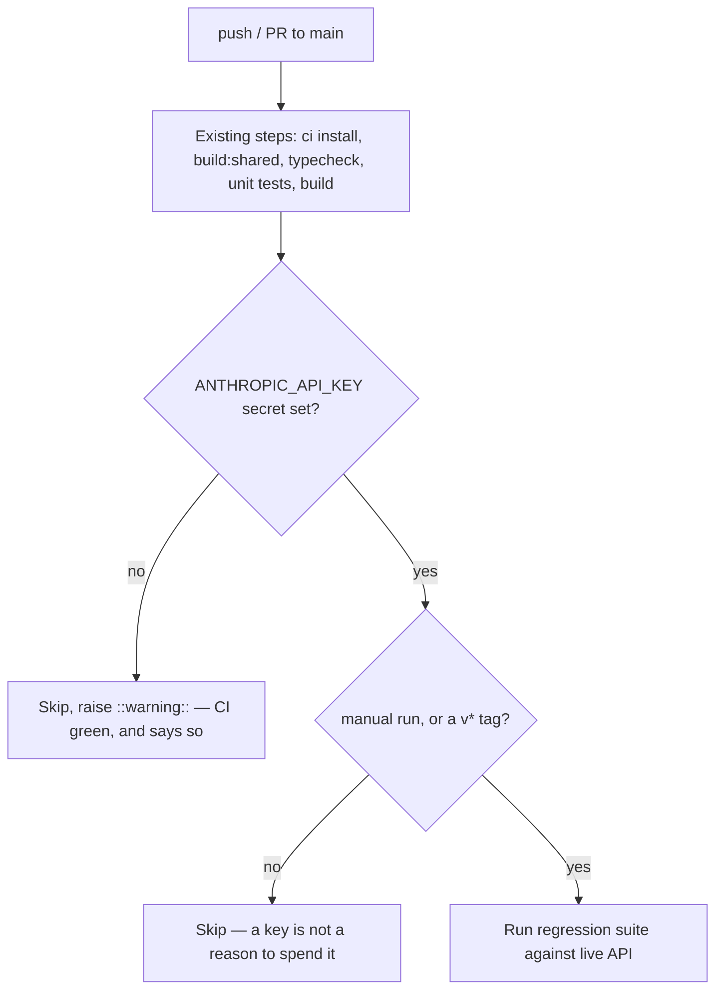

# Regression & Eval Suite — Decision Doc (Cycle 3)

*Status: complete — merged to `main` and tagged `v0.6.0` (Phases 01–04;
12 scenarios, verified over multiple clean live passes). Prerequisite:
`docs/MULTI_AGENT.md` (Cycle 2) complete and tagged `v0.5.0`.*

## Context

`docs/OBSERVABILITY.md` § Open items originally called this "Cycle 2" —
golden-dataset assertions on tool-call sequences, right after observability.
That ordering has been deliberately changed: regression testing now follows
the multi-agent system instead of preceding it.

The reason is timing, not doubt about the value of testing. A suite written
against the single-agent shape, right before that shape changed underneath
it (a second agent, a dispatcher, a reconciliation check), would have needed
rewriting the moment Cycle 2 landed — testing a system mid-change protects
against very little. Once Cycle 2 exists, two genuinely new failure modes
appear that didn't before: the dispatcher can send a turn to the wrong
agent, and a coordination bug between two agents' data can silently produce
a wrong reconciliation number. Neither trips the existing approval gate
(both are reads/milk/dispatch, not writes), and both now touch data — sales
figures — with real stakes. That combination is what earns this its own
cycle, motivated by something concrete rather than a general "should have
tests" instinct.

## What we're NOT doing

- **Not a broad 15–20 scenario general-coverage suite.** Scoped narrowly to
  what got riskier by going multi-agent (see Decision), not a first pass at
  testing everything the agent can do.
- **Not LLM-as-judge grading.** Assertions are on tool-call sequences and
  finish-reason values — mechanical checks, not a model scoring another
  model's response quality.
- **Not exact-text assertions.** Consistent with the rest of this app's
  design (digest, not raw text, is the thing that matters) — a passing test
  checks *which tools were called, with what key arguments, and in what
  order*, never the assistant's exact wording.
- **Not a hosted eval framework** (Promptfoo, Braintrust, DeepEval). All of
  them either lean toward a problem this project doesn't have yet (prompt-
  regression-gating at deploy scale) or don't fit the Node/TypeScript stack
  cleanly. A custom harness on Node's built-in test runner (`node:test` run
  via `tsx --test`) — the same runner the server already uses
  (`server/src/tools/shaper.test.ts`) — is simpler and adds **zero new
  dependencies** (`node:test` is built into Node; Vitest, used only in
  `web-angular`, would be a new dependency if pulled into the server).

## Decision

Scope the suite to the two things that became meaningfully riskier once
Cycle 2 shipped:

1. **Dispatcher correctness** — does a given turn route to the right tool
   list (`dairy`, `vendor`, or `both`)? Note the dispatcher (`selectAgent()`
   in `server/src/agent/dispatch.ts`) is a keyword/word-boundary matcher,
   not a model call — recon keywords force `both`, a lone dairy/vendor hit
   routes to that agent, and a comparison-cue follow-up escalates to `both`.
   These assertions are therefore effectively deterministic and low-flake.
2. **Reconciliation accuracy** — does `get_yield_vs_deliveries` compute the
   correct totals and `discrepancyLitres` against known seed data, including
   a case where the numbers are deliberately made to mismatch? The `flagged`
   boolean fires on a **5% tolerance** (`RECONCILE_TOLERANCE_PCT`), not exact
   equality: the "matched" scenario must stay within 5%, and the "mismatch"
   scenario must exceed it.

Everything else (the existing dairy read/write tools, the approval gate,
the digest/dataset split) already has a verification record from Cycle 1's
Phase 4–6 — re-litigating it here would be duplicate coverage, not new
protection.

**Golden dataset, ~12–15 scenarios:**

| Source | Scenarios |
| --- | --- |
| Reused from Cycle 1 Phase 4/5 (already verified against the live app) | chart read, guard rejection (nonexistent animal), approved write + resume, iteration cap (`AGENT_MAX_ITERATIONS=1`), model fallback |
| New — dispatcher | dairy-only query → `dairy` tool list only; vendor-only query → `vendor` tool list only; ambiguous/mixed query → `both` |
| New — reconciliation | matched yield/delivery totals (within 5% tolerance) → `flagged: false`; deliberately mismatched seed data (beyond tolerance) → `flagged: true` with the correct `discrepancyLitres` |
| New — vendor write gate | `record_delivery` pauses for approval exactly like `log_milking` does today |

**Harness decision:** run against the real Anthropic API, not a mocked
model. `docs/OBSERVABILITY.md`'s own verification standard was "run against
the actual live app (not simulated), each checked directly... rather than
taken on faith" — the same standard should apply here. The honest trade-off
that comes with it: real token cost per CI run, and the model is not
perfectly deterministic, so a scenario could occasionally need a retry
rather than failing outright. Recorded as an open item, not resolved away.

Note that the approval-gate pause is emitted as a plain `RUN_FINISHED` with
finish reason `awaiting_approval` (not a dedicated interrupt event) — see
`server/src/agent/stream.ts`. The finish-reason–based assertions below
handle this directly.



## Test harness

`server/src/agent/__tests__/` (all `node:test` files, same runner as the
unit tests under `server/src/tools/` and `server/src/farm/`):

- `harness.ts` — event-capture `runTurn()` + extractors (`selection`,
  `toolCalls`, `toolResults`, `resultFor`, `pendingCards`, `datasets`,
  `outcome`) and the `liveSkipReason()` gate.
- `scenarios.ts` — the golden dataset (dispatcher routing prompts + the two
  reconciliation windows, both derived from the seed's `daysAgo`).
- `regression.test.ts` — the 10 default-env scenarios.
- `regression.cap.test.ts`, `regression.fallback.test.ts` — the two cases
  that pivot on a module-load env const (`AGENT_MAX_ITERATIONS`,
  `ANTHROPIC_MODEL`). Each runs in its own process with the env set at
  launch, the same per-invocation approach Cycle 1 used.

How it works:

- Spin up a fresh, seeded SQLite DB per test via `beforeEach(seed)`.
  `seed()` was refactored to re-seed its `mulberry32` RNG on each call, so
  every seed is byte-identical and an approved write in one scenario never
  leaks into another.
- Call `runAgentStream()` directly (same entry point `POST /api/agent/run`
  uses) with a scenario's `messages`, and an `emit` callback that captures
  events instead of writing to an SSE response.
- Assert against the captured events: `TOOL_CALL_START` names + args (read
  back from the emitted opaque history), the finish-reason–equivalent
  `outcome()` (`awaiting_approval` for the write-gate cases, `iteration_cap`
  for the cap case, etc.), the `agent.selection` value for dispatcher cases,
  and — for reconciliation — the returned digest recomputed against ground
  truth from the same seeded DB, so the arithmetic is checked independent of
  which window the model chose.

The suite is gated behind `RUN_REGRESSION=1` (set only by the
`test:regression*` scripts) **and** an `ANTHROPIC_API_KEY`; absent either, the
whole `describe` skips (so its seeding hooks never run). This keeps the plain
`npm test` unit run free of token cost.

> **Superseded by Cycle 8.** This document originally added that the
> `src/**/*.test.ts` glob "only matches one directory deep, so the deeper
> `src/agent/__tests__/` files are excluded from it regardless" — offered as a
> convenient property. It was true and it was an **accident**: npm runs scripts
> through `sh`, where `**` is not globstar. The accident cut both ways, because
> a test placed one level deeper would also never run and would report nothing,
> while quoting the glob to "fix" it hands globbing to node, which *does*
> recurse and pulls in these regression files — where, without an API key, they
> emit `ok N … # SKIP` that the TAP summary counts as **passing**. CI would go
> green for a suite that never executed.
>
> So the script now **enumerates** its directories, and
> `src/testWiring.test.ts` asserts the listing is complete — every `*.test.ts`
> under `src/` is either matched by a pattern or on an `EXCLUDED` list with a
> reason and a `test:regression:*` script that reaches it. Do not rely on the
> glob property described above; rely on the wiring test. See
> [REGISTRY.md](REGISTRY.md) § "How `npm test` finds these tests".

This reuses the exact function the live server calls — no parallel
implementation of the loop to keep in sync.

## CI wiring

Add one job to the existing `.github/workflows/ci.yml`, after the current
steps (`npm ci` → `npm run build:shared` → `npm run typecheck` → `npm test
-w server` → `npm test -w web-angular` → `npm run build -w web-angular`):

> **This section prescribed a broken workflow until 2026-09-04, and it was
> wired in as written.** `secrets` is **not** an available context in a step's
> `if` — GitHub rejects the *entire workflow file* at validation, not just the
> step. Every CI run from at least 2026-08-25 failed in 0s with "likely ... a
> workflow file issue" and **nothing ran**: no typecheck, no unit tests, no
> build. The guard meant to keep this suite honest silenced every other check
> in the file. `actionlint` reports it precisely; the GitHub UI does not.

Presence has to be computed in a step, because `steps.<id>.outputs` **is**
available in `if`:

```yaml
  - name: Is an API key available?
    id: apikey
    env:
      ANTHROPIC_API_KEY: ${{ secrets.ANTHROPIC_API_KEY }}
    run: |
      if [ -n "$ANTHROPIC_API_KEY" ]; then
        echo 'present=true' >> "$GITHUB_OUTPUT"
      else
        echo 'present=false' >> "$GITHUB_OUTPUT"
        echo '::warning::live regression suite did NOT run. A skip is not a pass.'
      fi

  - name: Regression suite (live model)
    if: >-
      steps.apikey.outputs.present == 'true' &&
      (github.event_name == 'workflow_dispatch' ||
       startsWith(github.ref, 'refs/tags/v'))
    env:
      ANTHROPIC_API_KEY: ${{ secrets.ANTHROPIC_API_KEY }}
    run: npm run test:regression -w server
```

Two deliberate choices in there:

- **A job-level `env:` would be shorter and is the usual advice — don't.** It
  hands the secret to every step, including `npm ci`, where any dependency's
  install script could read it. Computing presence in its own step keeps the
  key scoped to the two steps that need it.
- **A key being available is not a reason to spend it.** On `main` this suite
  would bill on *every push*, which is precisely how API spend becomes
  unexplained usage nobody can attribute later. It runs on a manual
  `workflow_dispatch` or a `v*` tag — moments where someone asked.

`test:regression` chains three sub-scripts so each env-variant runs in its
own process (the aggregate is what the CI job invokes):

```jsonc
"test:regression":          "npm run test:regression:core && npm run test:regression:cap && npm run test:regression:fallback",
"test:regression:core":     "RUN_REGRESSION=1 tsx --test src/agent/__tests__/regression.test.ts",
"test:regression:cap":      "RUN_REGRESSION=1 AGENT_MAX_ITERATIONS=1 tsx --test src/agent/__tests__/regression.cap.test.ts",
"test:regression:fallback": "RUN_REGRESSION=1 ANTHROPIC_MODEL=claude-not-a-real-model-999 tsx --test src/agent/__tests__/regression.fallback.test.ts"
```

The guard matters: this repo already has a house convention for a missing
key — `GET /api/health` returns a friendly "run seed first" 503 and the chat
endpoint emits a `RUN_ERROR` (`unavailable`) with a degrade-gracefully message
rather than failing obscurely when things aren't configured. The regression job
follows the same convention: absent the secret, the step is skipped rather than
failing CI for contributors or forks that don't have it.

**But skipped visibly, and that word is load-bearing.** § "a skip is not a
pass" below is about this exact suite: it emits `ok N … # SKIP`, which TAP
counts as passing. So the absent-key branch raises a `::warning::` annotation —
a green run that states on its face that one thing was not checked. Silence
would satisfy the convention and defeat the point of it.



## Implementation plan

| Phase | Scope | State |
| --- | --- | --- |
| `regression/00-decisions` | This doc. | ✅ |
| `regression/01-golden-dataset` | 12 scenarios in `scenarios.ts` + the test files, reusing Cycle 1's Phase 4/5 cases where they fit the harness. | ✅ |
| `regression/02-harness` | `harness.ts` (event-capture `runTurn`, extractors, `outcome`) + `regression.test.ts`. | ✅ |
| `regression/03-ci-wiring` | `test:regression*` server scripts, the CI job, skip path verified with the opt-in absent. Repo secret `ANTHROPIC_API_KEY` still to be set in GitHub settings. | ⏳ secret |
| `regression/04-verification` | Two clean full live passes (12/12 each), no flakes observed. | ✅ |

Tagged `v0.6.0`. (The CI regression job stays skipped until the
`ANTHROPIC_API_KEY` repo secret is set — see the `03-ci-wiring` row.)

## Open items

- **Flakiness in practice is unknown until measured.** Two full local passes
  were clean (12/12), but that is a small sample. If the live-API approach
  produces meaningfully flaky CI (not just occasional), the fallback is
  recording one known-good transcript per scenario and replaying the model's
  tool-call decisions from it — a bigger change, worth avoiding unless the
  live approach actually proves unreliable. (The dispatcher cases are exempt
  from this risk — `selectAgent()` is a deterministic matcher, not a model
  call.)
- **"Unavailable API key" was dropped from the reused set.** That behavior is
  a *route-level* guard in `index.ts` (`POST /api/agent/run` emits
  `RUN_ERROR` `unavailable` before `runAgentStream` is ever called), not a
  property of `runAgentStream` itself — so it doesn't fit a harness built
  around calling that function directly, and testing it would mean standing
  up the Express app. Cycle 1 verified it against the live app; re-covering
  it here would need an HTTP-level test, deferred as not worth the harness.
- Whether to eventually widen this into the originally-planned 15–20
  scenario general suite, once the dispatcher and reconciliation logic have
  been stable for a while — deferred, not decided.
- No mocked-model path exists yet for contributors without an API key
  beyond "the job skips" — acceptable for a single-operator project, worth
  reconsidering if this repo ever gains other contributors.
