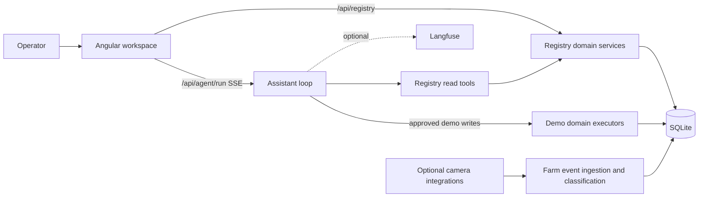

# System architecture

Current reference, reviewed against source at `43438b1` on 2 October 2026. This page explains application boundaries; detailed contracts live in the linked references.

Dairy 360 is a local operational registry with an optional assistant. Angular serves direct workflows for animals, health, milk, feed, labour and analytics. Express serves registry HTTP APIs and the separate assistant stream. SQLite holds persistent records. No authentication or multi-user tenancy is implemented.

## Data boundaries

| Area | Authority | Mutation path |
|---|---|---|
| Registry | `registry_*` source records; derived animal projections | Explicit forms/HTTP or CLI with domain validation |
| Assistant demo domains | Demo animals, milk, health, vendors and deliveries | Demo seed and approved assistant executors |
| Farm monitoring | Normalized `farm_events` and classification | Optional ingestion, deterministic classification and approved flagging |
| Browser | Unsaved drafts, recording session, chat history and display state | Transient client state; never proof that a write succeeded |

The demo seed resets its own tables and preserves registry records. It is not a registry fixture loader. Registry assistant tools are read-only. A demo animal and a registry animal are not interchangeable identities. Never use real farm records in test fixtures.

Registry domain functions accept database handles. Synthetic harnesses use memory-only storage; persistent server startup uses `server/dairy.db`. The schema runner applies ordered migrations, taking a pre-migration backup when applicable. Animal projections can be rebuilt; observations, payments, revisions and source records cannot be reconstructed from projections.

## Runtime and interfaces

- [Frontend](frontend.md): Angular standalone components, signals, router and registry HTTP services; shared assistant state.
- [Assistant](assistant.md): per-turn routing, read/write split, guardrails and model loop.
- [Protocol](protocol.md): AG-UI/SSE events, opaque history and approval resume.
- [Registry rules](../reference/registry/shared-rules.md): time, provenance, correction and retry boundaries.
- [Domain references](../reference/registry/README.md): calculations, workflows and limitations.
- [Integration references](../reference/integrations/README.md): optional camera events and classification.

Development ports and startup commands belong to [development](../guides/development.md). Configuration belongs to `server/.env`; root `.env` is for optional camera Compose configuration. Tracing is opt-in and absent credentials disable it.

## Non-negotiable distinctions

An unknown quantity is not zero. An approximate date is not an exact day. A planned treatment is not administration. Wages recorded are not wages paid. A feed purchase is not consumption. Assistant approval is authorization, not an execution receipt. Historical rates and recipient snapshots are retained with their saved records.

## Limits and evidence

The system has no production authentication/tenancy guarantee. Registry retry handling does not confer cross-request replay protection on assistant demo writes. Analytics reports qualified recorded facts, not inferred loss or clinical/nutritional advice. [Open work](../OPEN.md) and [acceptance evidence](../implementation/geist-screen-evidence/ACCEPTANCE.md) distinguish implementation from demonstrated acceptance.

Original architecture discussions are retained in [the overview record](../records/PROJECT_OVERVIEW.md).
