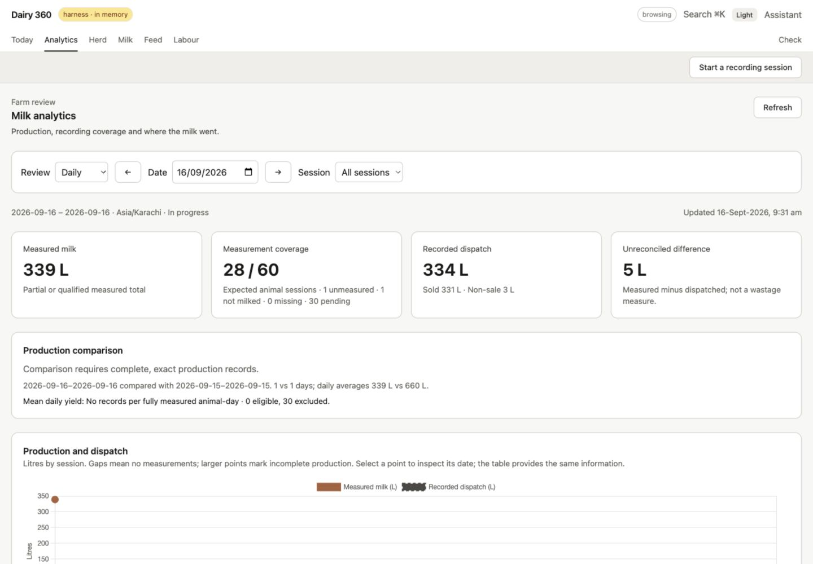
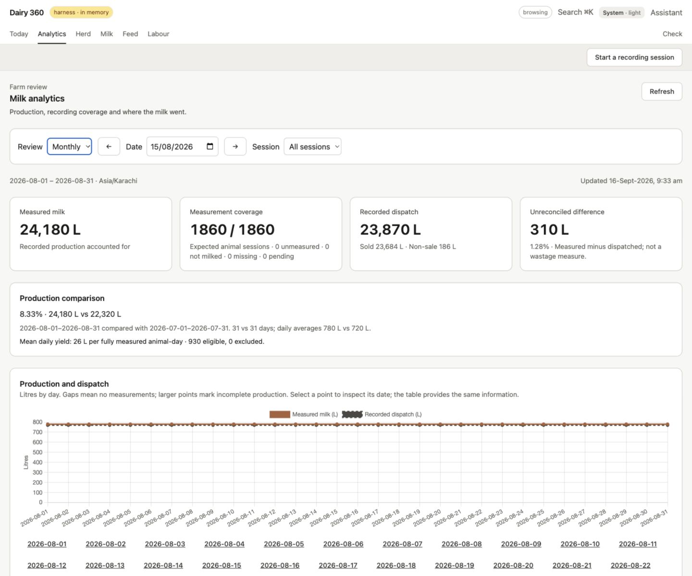
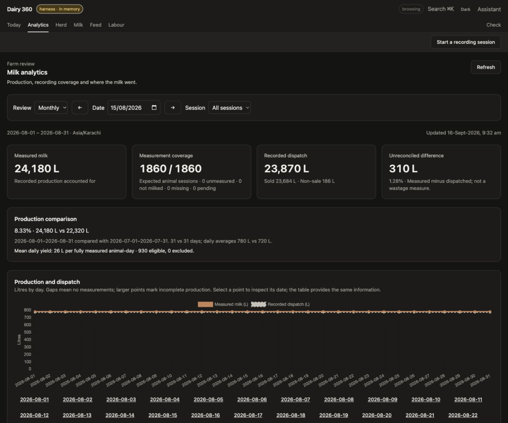
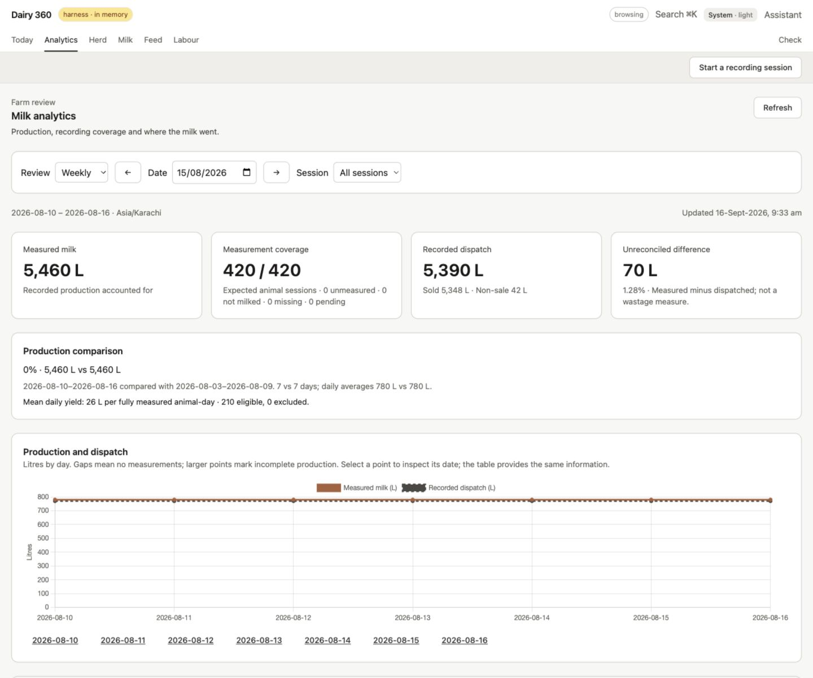
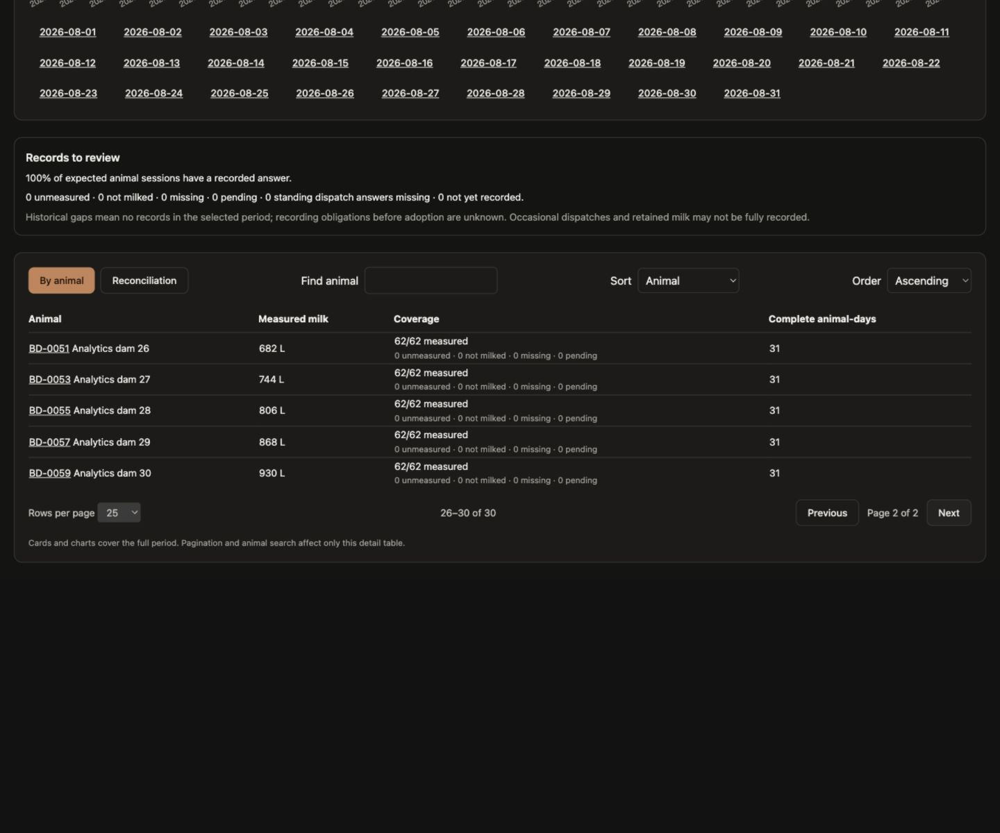
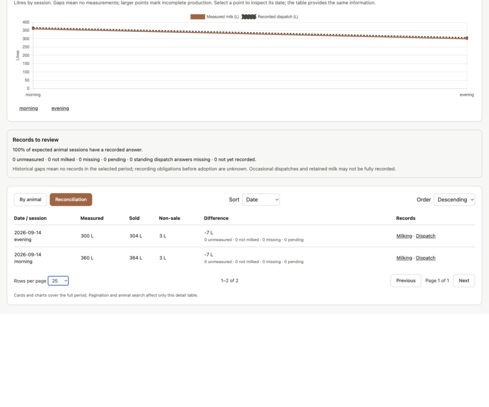
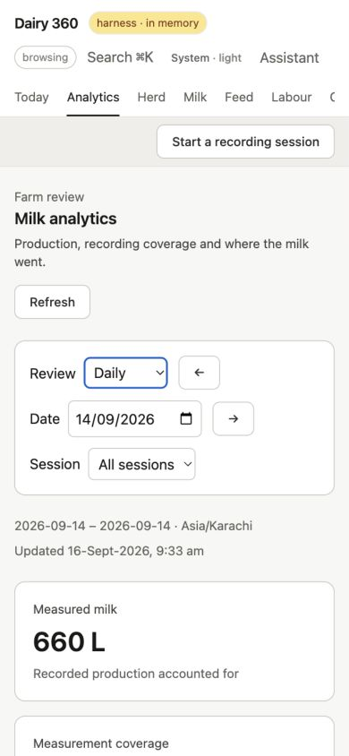

# Analytics screen gallery

Captured 2026-09-16 from the production Angular bundle served on port 6456,
backed by the dedicated `--analytics` in-memory harness on 6455. Farm today was
2026-09-16. These are disposable fixture records, not real-farm trial evidence.
See the [analytics specification](../../ANALYTICS_SPEC.md) for metric semantics,
scenario dates and `npm run harness:analytics` setup.

These are viewport captures, not full-page exports. Desktop is 1440×1200 except
the daily overview (1440×1000); mobile is 390×844. Detail captures scroll down to
the table. Light screenshots include the system theme resolving to light.
The mobile navigation scrolls horizontally and dashboard cards continue below the fold.

## Daily review — incomplete current day

September 16: unmeasured and not-milked morning answers, pending evening entries.

## Monthly review — light

August 2026: complete production, comparison with July and dispatch trend.

## Monthly review — dark

## Weekly review

August 10–16: full-week production and comparison with the preceding week.

## Animal production pagination

August production, page 2: rows 26–30 of 30. Cards and chart retain full-period totals.

## Reconciliation details

September 14: each session dispatches 7 L more than measured production. Source
links lead to the milking and dispatch records. The signed difference is not a
wastage measurement.

## Mobile daily review

September 14, top of page with stacked filters and metric cards.

